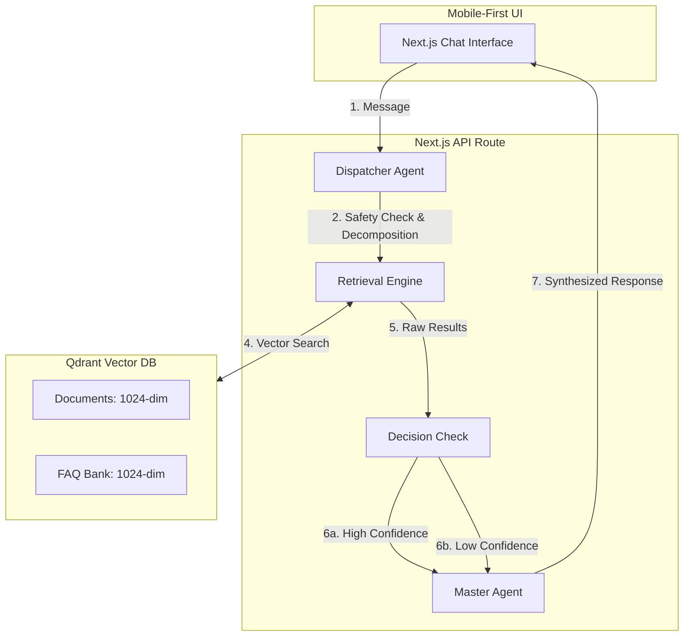

# URASys - VMG English Center Chatbot

A **Unified Retrieval Agent-Based System (URASys)** designed for VMG English Center to provide precise, context-aware answers regarding courses, tuition, and policies. It leverages a multi-agent orchestration layer and an optimized dual-retrieval pipeline.

## 🏗 Multi-Agent Architecture (Optimized Path B)

URASys operates through a collaborative ecosystem of specialized agents. The current implementation uses a **Streamlined Dispatcher Pattern** to minimize sequential LLM calls and ensure high-speed responses.



### The Agents
1.  **Dispatcher Agent (`ManagerService`):** A high-performance merged agent that handles both **Safety Guardrails** and **Query Decomposition** in a single parallel step. This reduces sequential latency by 30-50%.
2.  **Retrieval Engine (`SearchService`):** Powered by **Mistral Embeddings (1024 dimensions)**. Performs parallel semantic searches.
3.  **Master Agent (Route Handler):** The final synthesizer, optimized for a friendly, concise "Zalo-chat" style.
    - **High Confidence (>0.65):** Generates brief, direct answers using retrieved context.
    - **Insufficient Data:** Politely states lack of info and suggests related topics or professional consultation.

---

## 🚀 Key Features

*   **Low-Latency Dispatcher:** Merged safety and intent analysis to significantly reduce "Time to First Byte".
*   **Zalo-Style Conciseness:** Responses are designed to be extremely short, friendly, and direct, mimicking a real-time messaging experience.
*   **Mobile-First Full-Screen UI:** Designed to fill the viewport perfectly on all devices with custom height handling.
*   **Deep-Sync Indexing:** The indexing script automatically detects "ghost" embeddings (data in DB for files no longer on disk) and cleans them up.
*   **Resilient RAG Pipeline:** API timeout is set to 300s to handle complex parallel retrieval and generation tasks.

## 🛠 Tech Stack

*   **Frontend:** Next.js 15 (App Router), Tailwind CSS v4, Lucide Icons
*   **LLM Orchestration:** Poe API (OpenAI-compatible) - `grok-4.1-fast-non-reasoning`
*   **Embeddings:** Mistral AI - `mistral-embed` (1024 dimensions)
*   **Vector Database:** Qdrant Cloud
*   **Language:** TypeScript

---

## 📦 Setup & Installation

1.  **Install dependencies:**
    ```bash
    pnpm install
    ```

2.  **Configure Environment Variables:**
    Create a `.env` file based on `.env.example`.

3.  **Run Development Server:**
    ```bash
    pnpm dev
    ```

---

## 📚 Knowledge Management

### 1. High-Level Knowledge
Update `data/knowledge/vmg-overview.md` for core program information that is always present in the AI's context.

### 2. Automated Deep-Sync Indexing
To update the vector database:
1.  Place or update `.md` files in `data/vmg-docs/`.
2.  Run the indexing script:
    ```bash
    pnpm exec tsx scripts/index-docs.ts
    ```
    *   **Incremental:** Only processes new/modified files.
    *   **Cleanup:** Automatically removes embeddings for files deleted from the folder.
    *   **Auto-Indexing:** Automatically creates necessary payload indices in Qdrant.

### 3. Utility Scripts
*   **Check Sources:** List all files currently indexed in Qdrant:
    ```bash
    pnpm exec tsx scripts/check-sources.ts
    ```

---

## 📄 License
© 2025 VMG English Center. All rights reserved.