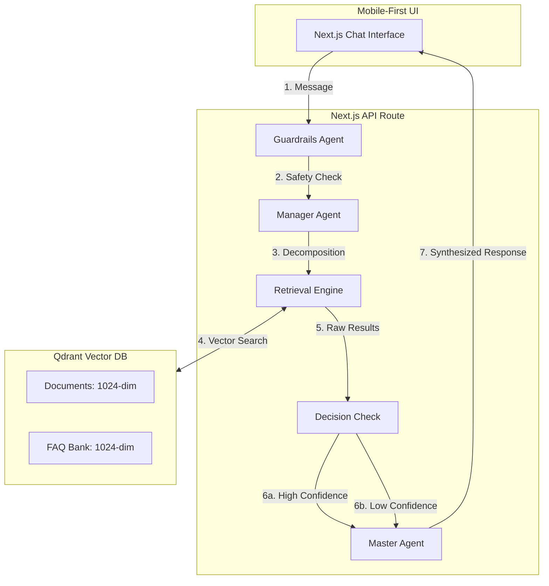

# URASys - VMG English Center Chatbot

A **Unified Retrieval Agent-Based System (URASys)** designed for VMG English Center to provide precise, context-aware answers regarding courses, tuition, and policies. It leverages a multi-agent orchestration layer and an optimized dual-retrieval pipeline.

## 🏗 Multi-Agent Architecture (Optimized Path B)

URASys operates through a collaborative ecosystem of specialized agents. The current implementation uses **Confidence Thresholding** to ensure high-accuracy responses without increasing latency.



### The Agents
1.  **Guardrails Agent (`GuardrailsService`):** Validates user input for safety and prevents prompt injection.
2.  **Manager Agent (`ManagerService`):** Analyzes conversation history to resolve ambiguity and decomposes queries into search tasks.
3.  **Retrieval Engine (`SearchService`):** Powered by **Mistral Embeddings (1024 dimensions)**. Performs parallel semantic searches.
4.  **Master Agent (Route Handler):** The final synthesizer.
    - **High Confidence (>0.65):** Generates a detailed response using retrieved context.
    - **Insufficient Data:** Triggers a specific protocol to politely state lack of info and refer to the hotline, preventing hallucinations.

---

## 🚀 Key Features

*   **Mobile-First Full-Screen UI:** Designed to fill the viewport perfectly on all devices with custom height handling.
*   **Hyper-Specific Consultation:** The Master Agent follows a strict protocol to ask one question at a time, aiming to understand the user's specific goals, level, and budget before proposing a cost-minimized roadmap.
*   **Ask-and-Augment Strategy:** Automatically transforms raw documents into high-quality Q&A pairs during the indexing phase.
*   **Centralized XML-Hybrid Prompting:** All prompts are managed in `src/prompts/` using XML tags for superior instruction following.
*   **Shiny-Text Loading:** Modern "shimmer" text indicator for an improved waiting experience.
*   **Interactive Suggestions:** Quick-action buttons to guide users toward common inquiries.

## 🛠 Tech Stack

*   **Frontend:** Next.js 15 (App Router), Tailwind CSS v4, Lucide Icons
*   **LLM Orchestration:** Poe API (OpenAI-compatible) - `grok-4.1-fast-non-reasoning`
*   **Embeddings:** Mistral AI - `mistral-embed` (1024 dimensions)
*   **Vector Database:** Qdrant Cloud
*   **Language:** TypeScript

---

## 📦 Setup & Installation

1.  **Install dependencies:**
    ```bash
    pnpm install
    ```

2.  **Configure Environment Variables:**
    Create a `.env` file based on `.env.example`:
    ```env
    POE_API_KEY=your_key
    POE_BOT_NAME=grok-4.1-fast-non-reasoning
    MISTRAL_API_KEY=your_key
    QDRANT_URL=your_url
    QDRANT_API_KEY=your_key
    ```

3.  **Run Development Server:**
    ```bash
    pnpm dev
    ```

---

## 📚 Knowledge Management

### 1. High-Level Knowledge
Update `data/knowledge/vmg-overview.md` for core program information that is always present in the AI's context.

### 2. Automated Q&A Indexing
To update the vector database:
1.  Place `.md` files in `data/vmg-docs/`.
2.  Run the indexing script:
    ```bash
    pnpm exec tsx scripts/index-docs.ts
    ```
    *This handles parallel processing, Q&A pair generation via Poe API, and Mistral vectorization.*

---

## 📄 License
© 2025 VMG English Center. All rights reserved.