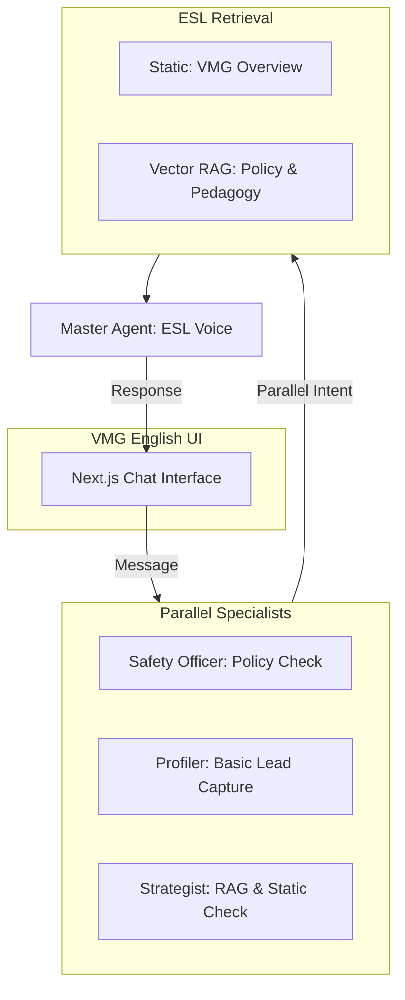
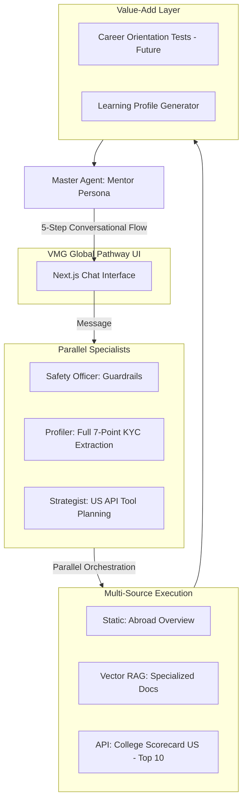

# URASys - VMG English Center Chatbot

A **Unified Retrieval Agent-Based System (URASys)** designed for VMG English Center to provide precise, context-aware answers regarding courses, tuition, and policies. It leverages a multi-agent orchestration layer and an optimized dual-retrieval pipeline.

## 🏗 Multi-Agent Architecture

URASys operates through two distinct specialized architectures tailored for different business goals, powered by a **Parallel Specialist Orchestration** layer.

### 1. VMG English Architecture (ESL Consultation)
Focused on high-speed response, course discovery, and simplified lead generation.



### 2. VMG Global Pathway Architecture (Study Abroad)
A complex 5-step consulting pipeline designed for deep discovery, KYC Level 1 extraction, and external academic data integration.



---

## 🚀 Key Features by Domain

### VMG English (ESL)
*   **Concise Messaging:** Optimized for quick, direct Zalo-style answers.
*   **Location Awareness:** Automatically guides users to one of the 12 local branches.
*   **Direct Lead Gen:** Simple "Ask -> Answer -> Contact" flow.

### VMG Global Pathway (Study Abroad)
*   **Conversational KYC:** Naturally extracts 7 data points (Country, Budget, Major, Intent, etc.).
*   **College Scorecard Integration:** Real-time data lookup for U.S. higher education institutions (Top 10 results).
*   **Paced Consultation:** Follows a strict 5-step Mentor methodology (**Discovery -> Value-Add -> Hook -> Engagement -> Retain**).
*   **Data-Driven Advice:** AI uses raw school data to provide qualitative advice rather than just listing numbers.

---

## 🛠 Technical Optimizations

*   **Parallel Orchestration:** Safety, Lead, and Strategy agents run concurrently via `Promise.all`, reducing sequential latency by ~60%.
*   **Token Efficiency:** Context windowing (last 10 messages) and RAG bypass for common static queries.
*   **Visual Debugging:** System badges allow real-time inspection of captured Lead JSON and Tool-call status.
*   **Human Simulation:** Complete removal of "AI/Bot" branding for a pure "Consultant" persona experience.

---

## 🚀 Key Features

*   **Token-Efficient Context:** Only the last 10 messages are sent to agents, maintaining focus and reducing costs.
*   **Fast Path (RAG Bypass):** 30-50% faster responses for common queries found in static knowledge.
*   **Intelligent Lead Capture:** Automatically extracts location/address to guide customers to the nearest VMG branch.
*   **Human-like Consultation:** Patient pacing (no premature phone number requests) and a professional yet friendly formal tone.
*   **Visual Debugging:** System badges allow real-time inspection of captured Lead JSON data.

---

## 🚀 Key Features

*   **Low-Latency Dispatcher:** Merged safety, intent, and lead analysis to significantly reduce "Time to First Byte".
*   **Pacing & Lead Generation:** AI is trained to listen and empathize before asking for contact info, ensuring a high-trust conversion rate.
*   **Visual Lead Confirmation:** UI displays a "System Message" (clickable) to verify captured lead data in real-time.
*   **Deep-Sync Indexing:** The indexing script automatically detects "ghost" embeddings (data in DB for files no longer on disk) and cleans them up.
*   **Zalo-Style UI:** Optimized for mobile viewports with shimmer indicators and guided suggestion buttons.

## 🛠 Tech Stack

*   **Frontend:** Next.js 15 (App Router), Tailwind CSS v4, Lucide Icons
*   **LLM Orchestration:** Poe API - `grok-4.1-fast-non-reasoning`
*   **Embeddings:** Mistral AI - `mistral-embed` (1024 dimensions)
*   **Vector Database:** Qdrant Cloud
*   **Data Capture:** Custom Lead Extraction via Dispatcher Agent

---

## 📦 Setup & Installation

1.  **Install dependencies:**
    ```bash
    pnpm install
    ```

2.  **Configure Environment Variables:**
    Create a `.env` file based on `.env.example`.

3.  **Run Development Server:**
    ```bash
    pnpm dev
    ```

---

## 📚 Knowledge Management

### 1. Automated Deep-Sync Indexing
To update the vector database:
1.  Place or update `.md` files in `data/vmg-docs/`.
2.  Run the indexing script:
    ```bash
    pnpm exec tsx scripts/index-docs.ts
    ```
    *   **Incremental:** Only processes new/modified files.
    *   **Cleanup:** Automatically removes embeddings for files deleted from the folder.

### 2. Utility Scripts
*   **Check Sources:** List all files currently indexed in Qdrant:
    ```bash
    pnpm exec tsx scripts/check-sources.ts
    ```

---

## 📄 License
© 2025 VMG English Center. All rights reserved.