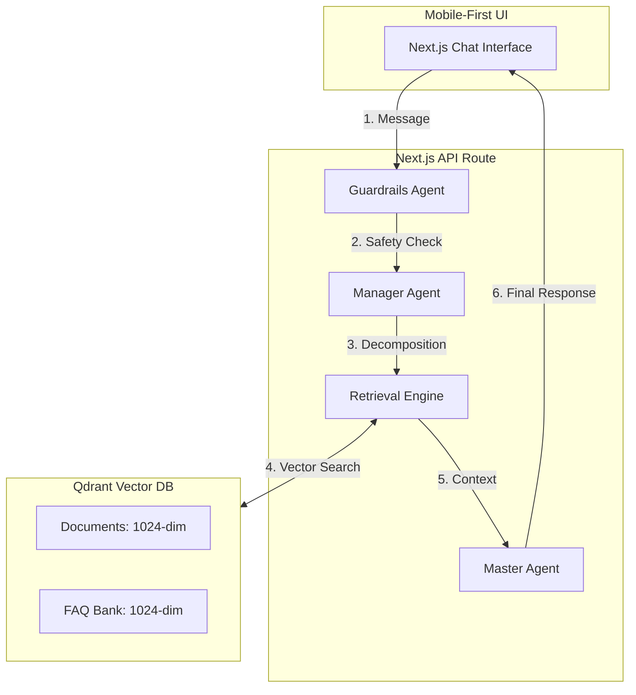

# URASys - VMG English Center Chatbot

A Unified Retrieval Agent-Based System (URASys) designed for VMG English Center to provide precise, context-aware answers regarding courses, tuition, and policies. It leverages a multi-agent orchestration layer and a dual-retrieval pipeline.

## 🏗 Multi-Agent Architecture

URASys operates through a collaborative ecosystem of specialized agents, each handling a specific part of the user journey.



### The Agents
1.  **Guardrails Agent (`GuardrailsService`):** The first line of defense. It validates user input for safety, harmful content, and prompt injection attempts.
2.  **Manager Agent (`ManagerService`):** The orchestrator. It analyzes the conversation history to resolve ambiguity (Query Refinement) and decomposes complex questions into optimized sub-queries for retrieval.
3.  **Retrieval Engine (`SearchService`):** Powered by **Mistral Embeddings (1024 dimensions)**. It performs parallel semantic searches across unstructured document chunks and a high-precision Q&A Bank.
4.  **Master Agent (Route Handler):** The synthesizer. It combines the retrieved context, static program overview (`vmg-overview.md`), and VMG's specific persona guidelines into a coherent, helpful, and branded response.

---

## 🚀 Key Features

*   **Mobile-First Design:** Fully responsive UI with custom viewport handling to fix common mobile browser layout issues.
*   **Dual-Phase Retrieval:** Combines "Document Search" for detail with "FAQ Search" for high-precision matching.
*   **Ask-and-Augment Strategy:** Automatically transforms raw documents into searchable Q&A pairs during indexing.
*   **XML-Hybrid Prompting:** System prompts are structured using XML tags for superior LLM instruction following.
*   **Incremental Indexing:** Smart indexing that only processes new or modified files, respecting rate limits and storage.

## 🛠 Tech Stack

*   **Frontend:** Next.js 14 (App Router), Tailwind CSS, Lucide Icons, React Markdown
*   **LLM Orchestration:** Poe API (OpenAI-compatible) - `grok-4.1-fast-non-reasoning`
*   **Embeddings:** Mistral AI - `mistral-embed` (1024 dimensions)
*   **Vector Database:** Qdrant Cloud
*   **Language:** TypeScript

---

## 📦 Setup & Installation

1.  **Install dependencies:**
    ```bash
    pnpm install
    ```

2.  **Configure Environment Variables:**
    Create a `.env` file based on `.env.example`:
    ```env
    # POE API
    POE_API_KEY=your_key
    POE_BOT_NAME=grok-4.1-fast-non-reasoning

    # Mistral AI
    MISTRAL_API_KEY=your_key

    # Qdrant
    QDRANT_URL=your_url
    QDRANT_API_KEY=your_key
    ```

3.  **Run Development Server:**
    ```bash
    pnpm dev
    ```

---

## 📚 Knowledge Management

### 1. High-Level Knowledge
Edit `data/knowledge/vmg-overview.md` to update core program information that the AI should *always* remember without needing retrieval.

### 2. Document Indexing
To update the vector database with detailed policies:
1.  Place `.md` files in `data/vmg-docs/`.
2.  Run the incremental indexing script:
    ```bash
    pnpm exec tsx scripts/index-docs.ts
    ```
    *Note: This script will automatically handle chunking, title generation, and Q&A expansion.*

---

## 📄 License
© 2025 VMG English Center. All rights reserved.
