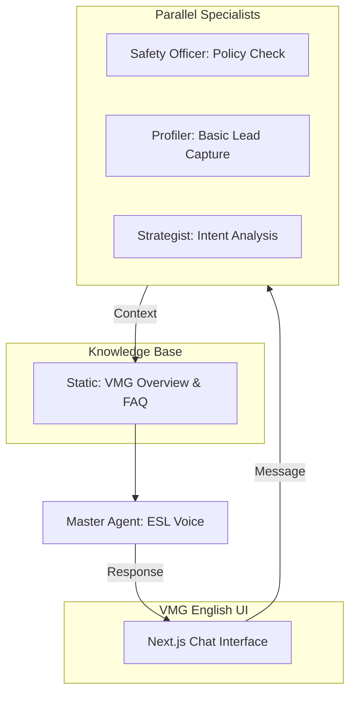
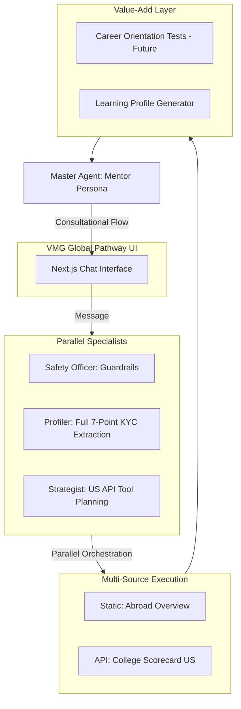

# URASys - VMG English Center Chatbot

A **Unified Retrieval Agent-Based System (URASys)** designed for VMG English Center to provide precise, context-aware answers regarding courses, tuition, and policies. It leverages a multi-agent orchestration layer and optimized static knowledge retrieval.

## 🏗 Multi-Agent Architecture

URASys operates through two distinct specialized architectures tailored for different business goals, powered by a **Parallel Specialist Orchestration** layer.

### 1. VMG English Architecture (ESL Consultation)
Focused on high-speed response, course discovery, and simplified lead generation using high-density static knowledge.



### 2. VMG Global Pathway Architecture (Study Abroad)
A complex consulting pipeline designed for deep discovery, KYC Level 1 extraction, and external academic data integration.



---

## 🚀 Key Features by Domain

### VMG English (ESL)
*   **Concise Messaging:** Optimized for quick, direct Zalo-style answers.
*   **Location Awareness:** Automatically guides users to one of the local branches in Dong Nai and Binh Phuoc.
*   **Direct Lead Gen:** Simple "Ask -> Answer -> Contact" flow.

### VMG Global Pathway (Study Abroad)
*   **Conversational KYC:** Naturally extracts 7 data points (Country, Budget, Major, Intent, etc.).
*   **College Scorecard Integration:** Real-time data lookup for U.S. higher education institutions.
*   **Paced Consultation:** Follows a strict Mentor methodology (**Discovery -> Value-Add -> Hook -> Engagement**).
*   **Data-Driven Advice:** AI uses raw school data to provide qualitative advice rather than just listing numbers.

---

## 🛠 Technical Optimizations

*   **Parallel Orchestration:** Safety, Lead, and Strategy agents run concurrently via `Promise.all`, reducing sequential latency by ~60%.
*   **Zero-Latency Retrieval:** Shift from Vector RAG to High-Density Static Knowledge ensures instantaneous context injection and 100% data reliability.
*   **Token Efficiency:** Optimized context windowing (last 10 messages) maintains conversation flow while controlling API costs.
*   **Human Simulation:** Complete removal of "AI/Bot" branding for a pure "Consultant" persona experience.
*   **Visual Debugging:** System badges allow real-time inspection of captured Lead JSON and Tool-call status in development.

---

## 🛠 Tech Stack

*   **Frontend:** Next.js 15 (App Router), Tailwind CSS v4, Lucide Icons
*   **LLM Orchestration:** Poe API - `grok-4.1-fast-non-reasoning`
*   **State Management:** React Hooks & Custom Viewport Utilities
*   **Data Capture:** Custom Lead Extraction via Parallel Specialists

---

## 📦 Setup & Installation

1.  **Install dependencies:**
    ```bash
    pnpm install
    ```

2.  **Configure Environment Variables:**
    Create a `.env` file based on `.env.example`. Ensure `POE_API_KEY` is set.

3.  **Run Development Server:**
    ```bash
    pnpm dev
    ```

---

## 📚 Knowledge Management

Knowledge is managed via high-density markdown files located in `data/knowledge/`:
*   `vmg-overview.md`: Contains all ESL course information, branch locations, and policies.
*   `study-abroad-overview.md`: Contains general study abroad guidance and VMG Global Pathway information.

To update the chatbot's knowledge, simply edit these markdown files. No re-indexing or database updates are required.

---

## 📄 License
© 2025 VMG English Center. All rights reserved.
