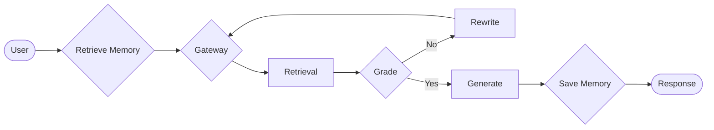

# VMG MATE - Multi-Agent Tooling Ecosystem

**Version: 4.0.0** — Hệ sinh thái trợ lý AI thông minh, sở hữu khả năng tự suy luận (Metacognition) và ghi nhớ dài hạn (Long-term Memory).

## 🌟 Tầm nhìn "Mate Vibe"
**VMG MATE** không chỉ là một chatbot, mà là một **Agentic System** — một người đồng hành kỹ thuật số chuyên nghiệp được thiết kế riêng cho cán bộ nhân viên VMG. Hệ thống tuân thủ triết lý: "Máy móc thực thi, con người điều hướng," đảm bảo tính minh bạch, sự kiểm soát và hiệu quả công việc tối đa.

### Quy trình suy luận (Agentic Flow)

```mermaid
flowchart LR
    User([User]) --> Memory{Retrieve Memory}
    Memory --> Router{Gateway}
    Router --> Retrieve[Retrieval]
    Retrieve --> Grade{Grade}
    Grade -- No --> Rewrite[Rewrite]
    Rewrite --> Router
    Grade -- Yes --> Gen[Generate]
    Gen --> MemorySave{Save Memory}
    MemorySave --> Response([Response])
```

## 🚀 Tính năng đột phá

### 1. Metacognitive Reasoning (Suy nghĩ về Suy nghĩ)
MATE hiển thị "Luồng tư duy" (Thought Trace) thời gian thực. Bạn có thể thấy cách Agent:
- Phân tích yêu cầu và định tuyến tri thức.
- Tự đánh giá chất lượng tài liệu tìm được.
- Tự sửa lỗi và thay đổi chiến lược tìm kiếm khi kết quả ban đầu không đạt yêu cầu.

### 2. Long-term Memory (Ghi nhớ dài hạn)
MATE sở hữu một "Trí nhớ vĩnh cửu" về người dùng:
- **Tự động trích xuất**: Một "Knowledge Agent" chạy ngầm sẽ ghi nhớ vai trò (Counselor, Manager), sở thích và các bối cảnh quan trọng của bạn.
- **Cá nhân hóa sâu**: MATE sử dụng tri thức đã ghi nhớ để đưa ra câu trả lời phù hợp nhất với vị trí công tác của bạn mà không cần nhắc lại.
- **Quyền kiểm soát**: Xem, chỉnh sửa hoặc xóa các "mảnh ký ức" tại trang Hồ sơ cá nhân.

### 3. Interactive Citation (Trích dẫn tương tác)
Mọi thông tin MATE đưa ra đều có bằng chứng:
- **Citations**: Các badge trích dẫn [Nguồn: file.pdf] xuất hiện ngay trong văn bản.
- **Source Preview**: Click vào trích dẫn để mở cửa sổ xem trước đoạn trích chính xác mà AI đã đọc từ tài liệu gốc.

## 🛠 Hướng dẫn thiết lập (Developer)

### Biến môi trường (`.env.local`)
Ngoài các cấu hình cơ bản, đảm bảo bạn đã thiết lập:
- `DATABASE_URL`: Sử dụng URL của Supabase Pooler (Port 6543).
- `NEXT_PUBLIC_SUPABASE_URL` & `NEXT_PUBLIC_SUPABASE_KEY`: Public Anon Key cho Client-side Auth.
- `SUPABASE_KEY`: Service Role Key cho Server-side operations.

### Cấu hình Auth (Supabase Dashboard)
Để Auth hoạt động trơn tru cả ở Local và Production:
1. Vào **Authentication > URL Configuration**.
2. **Site URL**: `https://vmg-chatbot.vercel.app`
3. **Redirect URLs**: Thêm `http://localhost:3000/**` để hỗ trợ phát triển local.

### Lệnh quan trọng
```bash
# Cài đặt
pnpm install

# Cập nhật Schema & Migrations
npm run db:push
npm run db:migrate

# Chạy App
pnpm dev
```

---
**VMG MATE** — *Your Intelligent Partner for a Smarter Workspace.*
Copyright 2026 VMG English Center.
