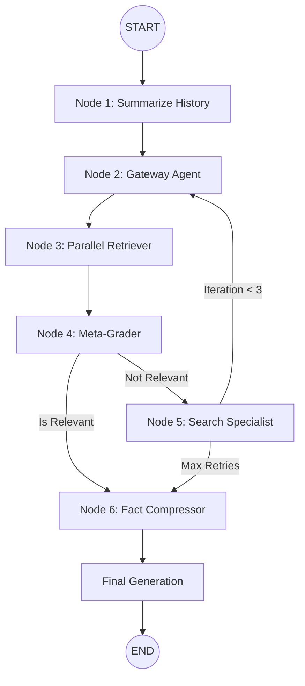

# VMG Knowledge Center - Agentic RAG Platform

Version: 2.6.0 - Self-Correcting Agentic Architecture with Iterative Routing.

An enterprise-grade internal knowledge platform for VMG staff, powered by a LangGraph state machine and a multi-phase ingestion pipeline. The system focuses on high-precision retrieval, cost transparency, and self-healing search strategies for Vietnamese language advisory contexts.

---

## Architecture

### The Agentic Workflow (LangGraph)

The system utilizes a state machine that can re-evaluate its own decisions if search results are insufficient.


```mermaid
graph TD
    START((START)) --> Summarizer[Node 1: Summarize History]
    Summarizer --> RouterExpand[Node 2: Gateway Agent]
    RouterExpand --> Retriever[Node 3: Parallel Retriever]
    Retriever --> Grade[Node 4: Meta-Grader]
    
    Grade -->|Is Relevant| Compressor[Node 6: Fact Compressor]
    Grade -->|Not Relevant| Rewriter[Node 5: Search Specialist]
    
    Rewriter -->|Iteration < 3| RouterExpand
    Rewriter -->|Max Retries| Compressor
    
    Compressor --> Final[Final Generation]
    Final --> END((END))
```

1.  **Summarize History:** For conversations longer than 4 turns, the system generates a strict summary (under 100 words) to preserve context while minimizing token costs.
2.  **Gateway Agent (Router + Expand):** A merged node that performs two tasks in a single LLM call:
    *   **Semantic Routing:** Analyzes user intent against knowledge silo descriptions to select the correct database.
    *   **Intent Expansion:** Generates 3-4 professional search variations (e.g., mapping "hoa hồng" to "thưởng incentive" or "KPI").
3.  **Parallel Retriever:** Searches the selected silos using the expanded queries. It performs cross-query deduplication and sorts results by semantic score, pruning the context to the top 5 highest-quality unique documents.
4.  **Meta-Grader:** Validates retrieved data using an XML-based reasoning schema. It strictly differentiates between "Related Topic" and "Specific Answer." If documents lack the precise information needed, it triggers a search retry.
5.  **Search Specialist (Rewriter):** If the Grader signals a failure, this node formulates a new search strategy.
6.  **Iterative Routing (Self-Correction):** Unlike standard RAG, the loop returns to the Gateway Agent. This allows the system to change its mind and search a different knowledge silo if the first choice was incorrect.
7.  **Fact Compressor:** Extracts technical facts, policies, and numbers into a concise Vietnamese "Fact Sheet" before final synthesis.

---

## Ingestion and Maintenance

The system implements a high-precision ingestion pipeline based on the URASys (Unified Retrieval Agent-Based System) framework.

### Ingestion Phases

1.  **Hierarchical Semantic Chunking:** Documents are segmented based on Markdown headers (H1-H3). Section context is automatically prepended to every child chunk to ensure searchability.
2.  **URASys Phase 1 (Context-Aware Rewriting):** Chunks are rewritten by an LLM to be self-contained, replacing vague pronouns with specific entity names based on the full document context.
3.  **URASys Phase 2 (Ask-and-Augment):** The system predicts 5 potential user questions for every chunk. These intents are baked into the vector payload for "Intent-to-Intent" matching.
4.  **Smart Skeleton Summarization:** Large documents (hundreds of pages) are summarized by sampling headers and content at 0, 25, 50, 75, and 100 percent marks, creating an architectural map of the file without exceeding token limits.
5.  **Manual Summary Refresh:** Users can manually trigger a summary regeneration via the "Sparkles" button in the Admin UI. This fetches existing data from Qdrant and updates the file and collection descriptions without re-processing the raw file.

---

## Technical Specifications

### Cost and Performance Tracking
The system provides full transparency via console payload logging:
*   **Payload In:** Character count of prompt plus context sent to the LLM.
*   **Payload Out:** Character count of the LLM response.
*   **Token Estimation:** Multiply total characters by 0.25 for a reliable token count.

### Tech Stack
*   **Framework:** Next.js 15 (Turbopack)
*   **State Machine:** LangGraph.js
*   **Vector Database:** Qdrant Cloud (Hybrid Search)
*   **Storage:** Supabase Storage
*   **ORM:** Drizzle ORM (PostgreSQL)

---

## Development

```bash
# 1. Install dependencies
pnpm install

# 2. Synchronize Database Schema
npx drizzle-kit push --force

# 3. Pull environment variables
vercel env pull .env.local

# 4. Start development server
pnpm dev
```

Admin Access: `/admin` (Default Password: `ilovevmg`)

---
Copyright 2026 VMG English Center - Internal Knowledge Base
