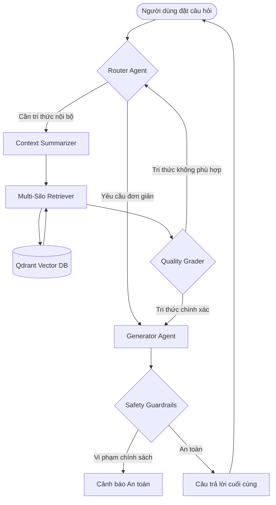
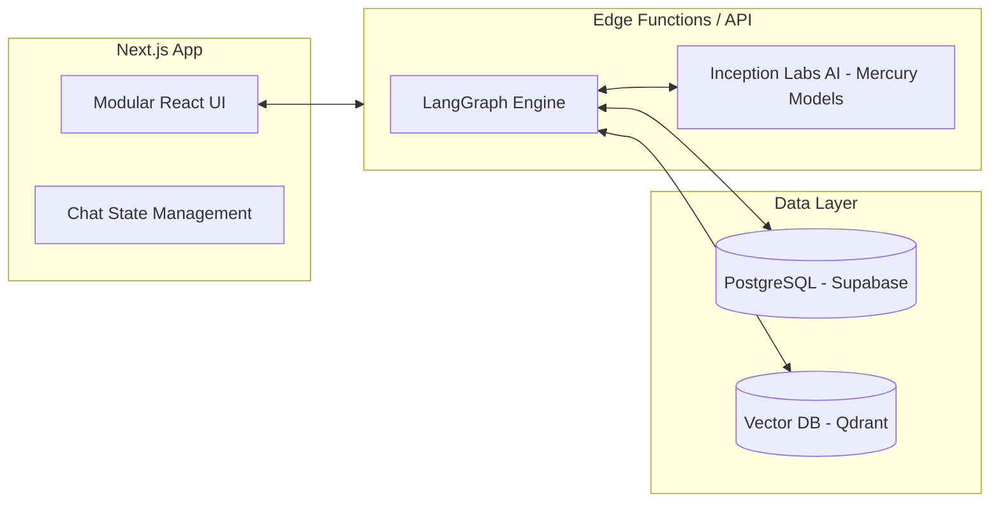

# VMG MATE - Multi-Agent Tooling Ecosystem

**Version: 3.0.0** — Hệ sinh thái cộng tác thông minh dựa trên Agentic RAG và Multi-Agent Orchestration.

## 🌟 Tầm nhìn "Mate Vibe"
**VMG MATE** (Multi-Agent Tooling Ecosystem) là một "người bạn" (Mate) trí tuệ, được thiết kế để đồng hành và cộng tác trực tiếp với nhân viên VMG trong việc quản lý tri thức và thực thi dự án.

---

## 🏗️ Kiến trúc hệ thống (System Architecture)

### 1. Luồng tư duy Agentic (Thinking Flow)
MATE sử dụng LangGraph để điều phối một đồ thị trạng thái tuần hoàn, cho phép AI tự sửa lỗi và tối ưu câu trả lời thông qua các bước suy luận chuyên sâu.


```mermaid
graph TD
    User([Người dùng đặt câu hỏi]) --> Router{Router Agent}
    
    Router -- Yêu cầu đơn giản --> Generator[Generator Agent]
    Router -- Cần tri thức nội bộ --> Summarizer[Context Summarizer]
    
    Summarizer --> Retriever[Multi-Silo Retriever]
    Retriever --> Qdrant[(Qdrant Vector DB)]
    Qdrant --> Retriever
    
    Retriever --> Grader{Quality Grader}
    
    Grader -- Tri thức không phù hợp --> Router
    Grader -- Tri thức chính xác --> Generator
    
    Generator --> Safety{Safety Guardrails}
    Safety -- Vi phạm chính sách --> Warning[Cảnh báo An toàn]
    Safety -- An toàn --> Final[Câu trả lời cuối cùng]
    
    Final --> User
```

### 2. Sơ đồ thực thi hệ thống (System Stack)
Mô hình kết nối giữa các lớp ứng dụng và cơ sở dữ liệu.


```mermaid
flowchart LR
    subgraph Frontend [Next.js App]
        UI[Modular React UI]
        State[Chat State Management]
    end

    subgraph Backend [Edge Functions / API]
        LG[LangGraph Engine]
        IL[Inception Labs AI - Mercury Models]
    end

    subgraph Storage [Data Layer]
        Supabase[(PostgreSQL - Supabase)]
        Qdrant[(Vector DB - Qdrant)]
    end

    UI <--> Backend
    LG <--> IL
    LG <--> Supabase
    LG <--> Qdrant
```

---

## 🏗️ Chi tiết kỹ thuật

### 1. Agentic Workflow (LangGraph)
- **Router:** Phân tích intent và điều hướng kỹ năng.
- **Inception Labs Engine:** Sử dụng các model **Mercury** tiên tiến cho khả năng suy luận (Reasoning) phức tạp và lập kế hoạch.
- **Retriever:** Truy xuất đa không gian (Multi-Silo) song song.
- **Grader:** Ngăn chặn ảo giác (Hallucination) bằng cách kiểm định tài liệu từ Qdrant.

### 2. Công nghệ lưu trữ (Storage & RAG)
- **Vector DB:** Qdrant (Metadata filtering, High-speed search).
- **ORM:** Drizzle ORM (Type-safe migrations & queries).
- **Database:** Supabase (Conversation history, Silo Management).

### 3. Pipeline xử lý dữ liệu (URASys)
Hệ thống ingestion theo chuẩn **Hierarchical Semantic Chunking**:
- **Semantic Splitting:** Chia nhỏ tài liệu theo ngữ nghĩa thay vì số ký tự.
- **Auto-Summarization:** Sử dụng LLM nén tri thức ngay khi upload để tối ưu hóa quá trình định tuyến của Agent.

---

## 🛠️ Tech Stack
- **Frontend:** Next.js 16.2.4, Tailwind CSS 4, Lucide, Sonner.
- **Agent Core:** LangGraph, LangChain.
- **AI Models:** Inception Labs (Mercury Series), Poe (Fallback).
- **Data:** Qdrant, Supabase, Drizzle.

---

## 🚀 Quy trình phát triển (Development)

### Cài đặt
```bash
pnpm install
npm run db:migrate
pnpm dev
```

### Quản lý Database
- `npm run db:generate`: Tạo migration.
- `npm run db:migrate`: Áp dụng thay đổi.

---
**VMG MATE** — *Your Intelligent Partner for a Smarter Workspace.*
Copyright 2026 VMG English Center.
