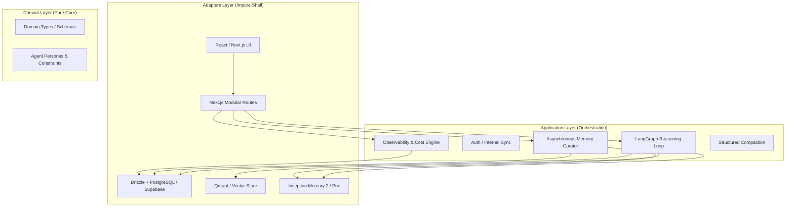
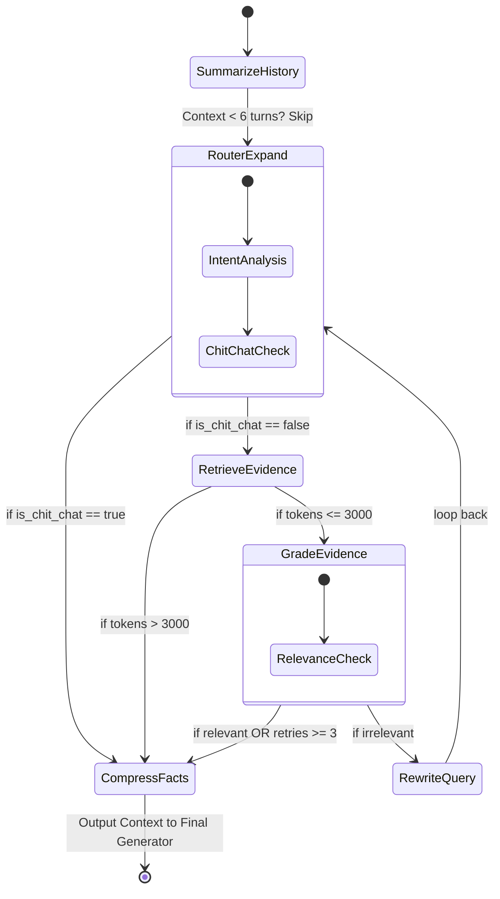
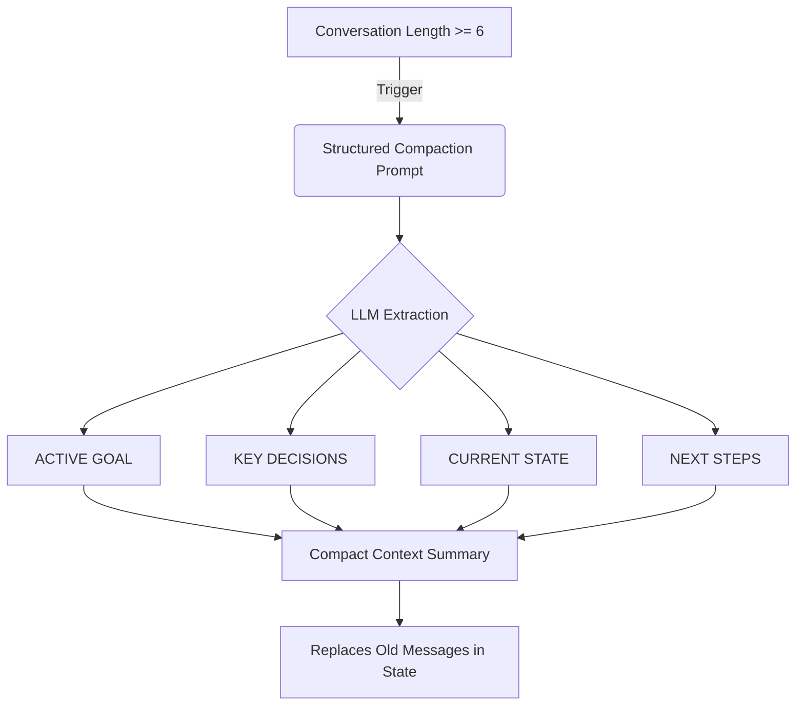
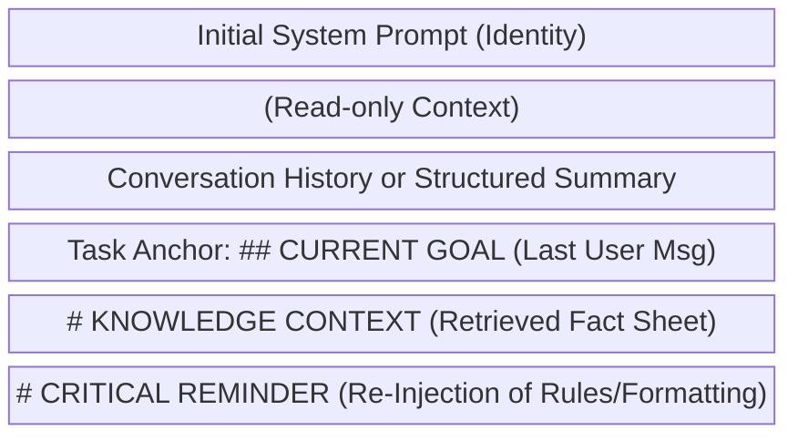
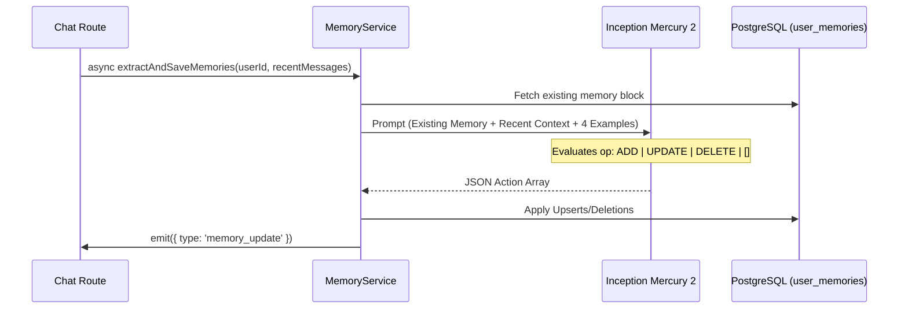
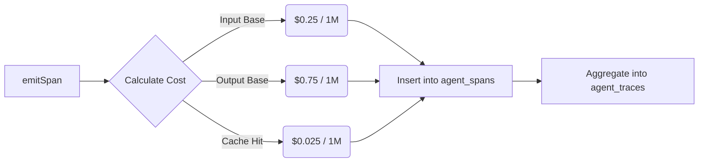

# VMG MATE: Agentic Architecture & Ecosystem

**VMG MATE (Multi-Agent Tooling Ecosystem) Version 4.0.0** is a high-integrity Agentic AI system built on Clean Architecture, "Glass Box" observability principles, and advanced Context Engineering. 

It is designed as a professional digital companion for VMG English Center employees, operating under the philosophy: **"Machines execute, humans direct."**

---

## 1. High-Level System Architecture

VMG MATE follows strict layer separation (Clean Architecture), ensuring that domain logic is pure and side effects are pushed to the adapter layers.

---

## 2. Multi-Agent RAG Graph (The "Thinking" Phase)

The core reasoning of VMG MATE is managed by a LangGraph state machine (`src/core/agent/rag-graph.ts`). It employs a Metacognitive Reasoning loop that is visible to the user in real-time.

### Agent Roles in the Graph:
1. **Gateway Agent (RouterExpand)**: Classifies "chit-chat" vs "factual" queries. Selects target knowledge silos and expands initial queries.
2. **Search Specialist (Retrieve)**: Executes parallel BM25/Vector hybrid searches across Qdrant collections.
3. **Knowledge Evidence Grader (Grade)**: Evaluates if retrieved documents actually answer the user's intent.
4. **Query Optimization Specialist (Rewrite)**: If grading fails, rewrites queries based on past failures to widen or narrow the search.
5. **Knowledge Architect (Compress)**: Transforms raw retrieved data into a **SUPER CONCISE Fact Sheet**, shedding 50%+ of redundant tokens before final generation.

---

## 3. Context Management & Rot Defenses

To prevent **Context Rot** (instruction fade-out, goal drift, and attention dilution) during long-running conversations, VMG MATE implements industry-leading Context Engineering.

### A. The 40-60% Rule & Structured Compaction
Instead of naive truncation, MATE uses an aggressive, early compaction strategy starting at **6 conversation turns**.

### B. Instruction Re-Injection & Task Anchoring
To defeat the "Lost-in-the-Middle" effect, critical instructions are dynamically injected at the *end* of the context window.

---

## 4. Long-Term Memory Curator (The "Knowledge Auditor")

VMG MATE possesses a "Trí nhớ vĩnh cửu" (Eternal Memory). A background agent continuously monitors the chat and extracts explicit personal disclosures.

### Hybrid Few-Shot Architecture
Rather than relying on brittle regex or hardcoded procedural logic, the Curator uses **Hybrid Few-Shot Prompting** with `reasoning_effort: 'high'`.

**Anti-Garbage Rules**:
- ONLY remembers explicit personal info (Name, role, department, preferences).
- NEVER remembers questions ("what is X?"), AI-retrieved facts, or technical requests.

---

## 5. Observability & Cost Engine ("Glass Box")

VMG MATE tracks every LLM invocation granularly.

### Span Tracking
Every node in the RAG Graph emits a `SpanData` payload tracking:
- `nodeName` (e.g., 'router_expand', 'grade')
- `model` used
- `promptTokens`, `completionTokens`
- `cachedTokens`, `cacheCreationTokens`
- `latencyMs`

### Tiered Pricing Logic
Calculates exact USD cost based on Inception Mercury 2's pricing tiers, including heavy discounts for Context Caching.

---

## 6. Model Provider Configurations

| Engine / Node | Reasoning Effort | Justification |
| :--- | :--- | :--- |
| **Agentic Steps** (Router, Grader, Rewriter, Summarizer) | `instant` | Speed is critical for multi-step loops. Cost efficiency. |
| **Final Generation** | `high` | Maximum cognitive depth for synthesizing complex policies and facts. |
| **Knowledge Architect** (Compressor) | `high` | Requires deep structural understanding to compress accurately without hallucination. |
| **Memory Curator** (Background) | `high` | Accuracy is paramount over latency for long-term state. Needs strict JSON compliance. |

---
*Document Generated: April 2026*
