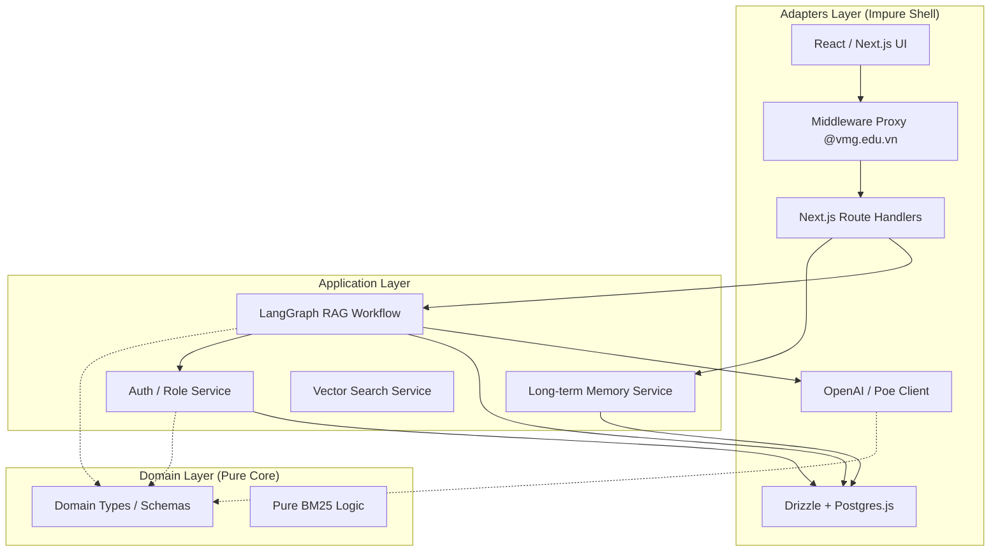
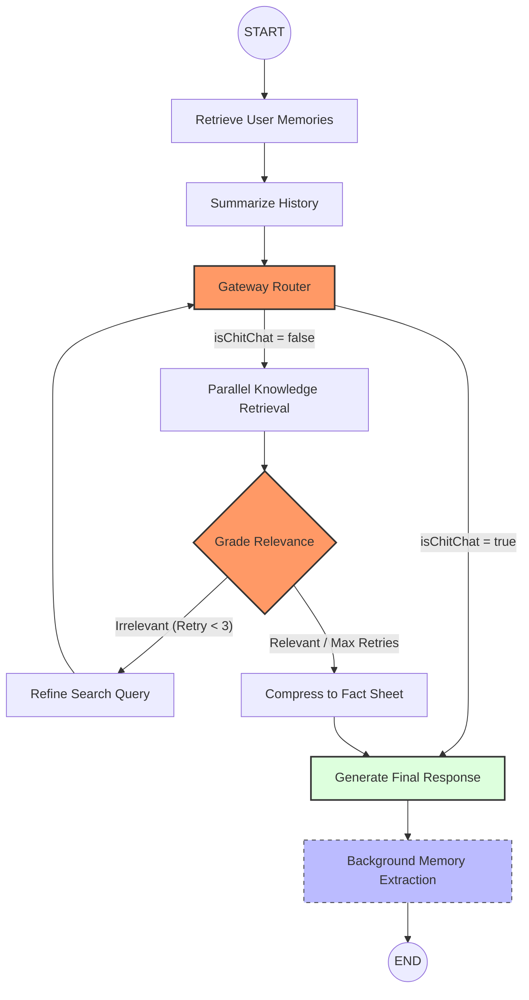

# Project Architecture: VMG MATE

This document provides a comprehensive technical overview of the VMG MATE system, mapping its components to Clean Architecture layers and detailing the sophisticated Agentic systems implemented.

## 1. Core Principles
- **Dependency Rule**: Dependencies point inward: `Adapters → Application → Domain`.
- **Pure Domain**: The Domain layer contains zero side effects or external dependencies.
- **Agent Legibility**: Code is optimized for agent comprehension first (max 300 lines per file, clear naming, explicit types).
- **Metacognitive Transparency**: The system is designed to expose its internal reasoning (Thinking Trace) to build user trust.

## 2. System Architecture

## 3. Sophisticated Agentic Systems

### A. Metacognitive Reasoning Flow (LangGraph)
The following graph describes the internal "inner monologue" and self-correction loop of VMG MATE:

### B. Persistent Context Engineering (Long-term Memory)
MATE implements a "Knowledge Agent" pattern to bridge the gap between sessions.
- **Extraction**: A background task uses LLM reasoning to extract persistent facts (Persona, Preferences, Entities) from user messages.
- **Refinement**: Facts are rewritten in the **third person** to create a structured knowledge graph of the user.
- **Deduplication**: Semantic and exact checks prevent redundant snippets from cluttering the memory.
- **Injection**: Stored memories are retrieved and injected into the System Prompt at the start of every chat, allowing for deep personalization.

### C. Interactive Citation Pipeline
Transparency is enforced through a multi-stage citation pipeline:
- **Metadata Propagation**: Document sources (filenames) and exact text snippets are preserved from the Vector DB through the compression phase.
- **JSON Streaming**: The API emits a `citations` metadata block at the end of the stream.
- **Interactive UI**: The frontend parses specific citation syntax and renders clickable badges that open a **Source Preview Drawer**, showing the exact excerpt used by the AI.

## 4. Layer Mapping

### Domain Layer (`src/core/types/`, `src/core/lib/`)
- `src/core/types/chat.ts`: Defines the core `Message` entity, now extended with `reasoningTrace`, `citations`, and `memoryUpdated` fields.
- `src/core/lib/bm25.ts`: Pure algorithmic implementation of BM25 for hybrid search ranking.

### Application Layer (`src/core/agent/`, `src/core/services/`)
- `src/core/agent/rag-graph.ts`: The central orchestrator of the agentic reasoning process.
- `src/core/services/memory.service.ts`: Handles the complex logic of extracting and structuring user memories.
- `src/core/services/auth.service.ts`: Manages user synchronization and maps external Supabase IDs to internal DB IDs.

### Adapters Layer (`src/app/api/`, `src/components/`, `src/proxy.ts`)
- **Stateful Chat Layout**: The `ChatInterface` is hosted in `src/app/(main)/layout.tsx`, allowing it to persist state (streaming text, reasoning) during navigation between the hub and specific chat IDs.
- **Metacognitive Console**: `AgentSteps.tsx` provides a collapsible, bulleted trace of the agent's internal monologue.
- **Minimalist Profile**: `src/app/(main)/profile/page.tsx` uses an admin-table aesthetic to give users full control (View, Edit, Delete) over their long-term memory.

## 5. Security & Multi-Tenancy
- **Domain Restriction**: Enforced at the Edge via `src/proxy.ts` (Next.js Middleware).
- **Environment Isolation**: The OAuth flow uses environment-aware redirection (Site URL vs. Redirect URLs) to handle local development and production seamlessly.
- **RBAC**: Role-based access control hides administrative tools (e.g., Admin Panel) based on `app_metadata` claims.
