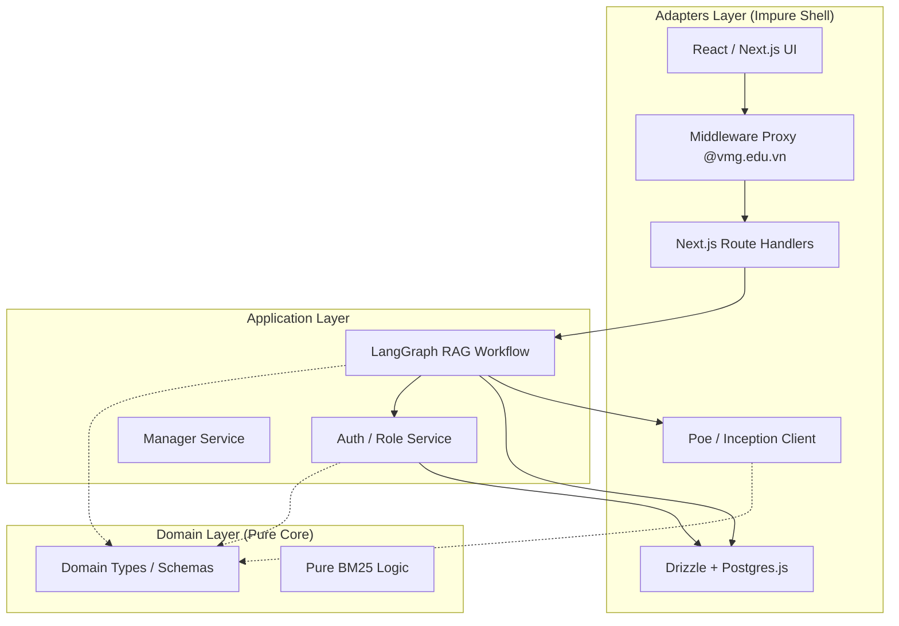
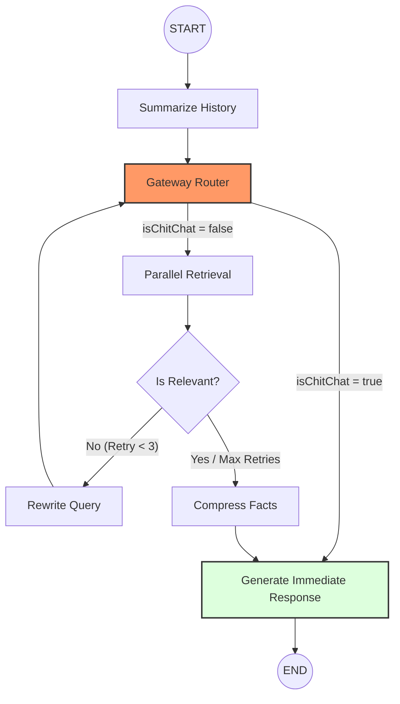

# Project Architecture: VMG MATE

This document maps the VMG MATE codebase to Clean Architecture layers as defined in `GEMINI.md`.

## 1. Core Principles
- **Dependency Rule**: Dependencies point inward: `Adapters → Application → Domain`.
- **Pure Domain**: The Domain layer contains zero side effects or external dependencies.
- **Agent Legibility**: Code is optimized for agent comprehension first.

## 2. System Architecture

## 3. Agentic RAG Flow (LangGraph)

## 4. Layer Mapping

### Domain Layer (`src/core/types/`, `src/core/lib/`)
Contains pure business logic and entity definitions.
- `src/core/types/agent.ts`: Domain types for the Multi-Agent system.
- `src/core/types/chat.ts`: Domain types for the conversation system.
- `src/core/lib/bm25.ts`: Pure algorithmic implementation of BM25.

### Application Layer (`src/core/agent/`, `src/core/services/ports.ts`)
Orchestrates domain operations and defines ports for external communication.
- `src/core/agent/rag-graph.ts`: LangGraph implementation with **Chit-Chat Detection** routing.
- `src/core/agent/state.ts`: Application state management including `isChitChat` and `isRelevant` flags.

### Adapters Layer (`src/core/services/`, `src/app/api/`, `src/components/`)
Handles all side effects and external integrations.

#### Driven Adapters (Infrastructure)
- `src/core/db/index.ts`: Database client using **Singleton Pattern** with `globalThis` to prevent connection leaks. Strictly limited to `max: 5` connections for Supabase pooler compatibility.
- `src/core/lib/supabase-server.ts`: Server-side Supabase client using `@supabase/ssr` for secure cookie management.
- `src/core/services/auth.service.ts`: User synchronization logic and RBAC validation.

#### Driving Adapters (UI & API)
- `src/proxy.ts`: Next.js 16 Middleware (Proxy) for **@vmg.edu.vn** domain restriction.
- `src/app/api/auth/callback`: Secure OAuth exchange route.
- `src/components/layout/Sidebar.tsx`: Interactive sidebar with Portal-based menus and "Silent Refresh" logic.

## 3. Boundary Validation
All external data entering the system via `src/app/api` is validated using Zod schemas (implemented in `src/env.ts` and route handlers).

## 4. Cross-Cutting Concerns
- **Auth**: Multi-tier security (Proxy → Server Component Role Check → Database Indexing).
- **Environment**: Centralized in `src/env.ts` using `@t3-oss/env-nextjs`.
- **Performance**: Database indexing on `user_id` and Middleware bypass for internal API calls.
