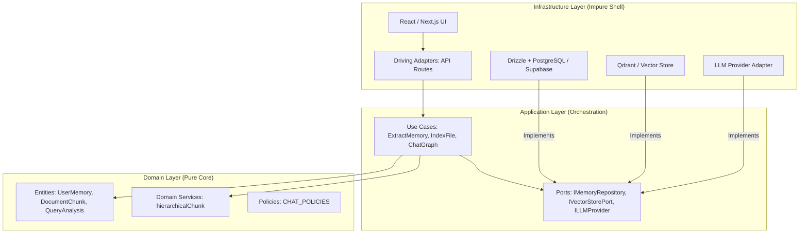
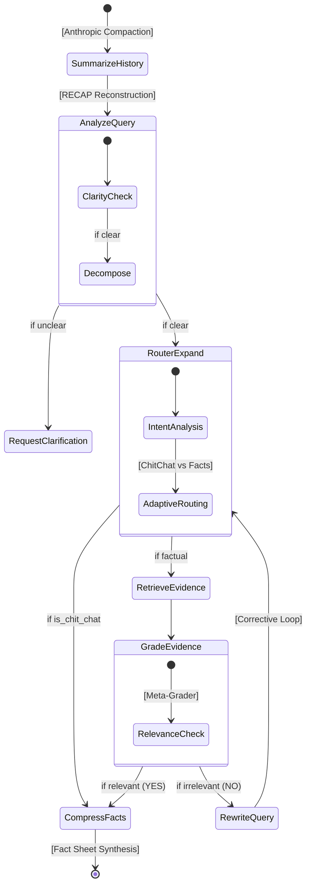

# VMG MATE: Agentic Architecture & Ecosystem

**VMG MATE (Multi-Agent Tooling Ecosystem) Version 4.1.0** is a high-integrity Agentic AI system built on strict **Clean Architecture**, "Glass Box" observability principles, and advanced Context Engineering. 

It is designed as a professional digital companion for VMG English Center employees, operating under the philosophy: **"Machines execute, humans direct."**

---

## 1. High-Level System Architecture

VMG MATE follows a strict 3-layer Clean Architecture, ensuring that domain logic is pure and infrastructure details are completely decoupled via Ports.

---

## 2. Agentic RAG Taxonomy (Hybrid Adaptive-Corrective)

VMG MATE is formally classified as a **Hybrid Adaptive-Corrective Multi-Agent RAG** system. It combines dynamic query routing with self-correcting retrieval loops.

### Advanced Agent Roles:
1. **Query Architect (RECAP-Integrated)**:
   - **Ellipsis Resolution**: Reconstructs elliptical queries (e.g., "Còn ở Úc?") into standalone search instructions.
   - **Refinement Detection**: Protects against "Fake Intent Shifts" by recognizing when a user is refining a previous goal rather than changing it.
2. **Gateway Agent (Orchestrator)**:
   - Performs **Adaptive Routing** between specialized knowledge silos and general chit-chat.
3. **Search Specialist (Worker)**:
   - Executes **Hierarchical Retrieval**, mapping precise Child chunks back to stable Parent contexts.
4. **Knowledge Evidence Grader (Reflection)**:
   - Implements **Corrective RAG (CRAG)** principles to validate if retrieved evidence is sufficient for a high-integrity answer.
5. **Knowledge Architect (Compression)**:
   - Performs **Deep Token Distillation**, reducing evidence by 50%+ to maximize the model's **Attention Budget**.

---

## 3. Context Engineering & Rot Defenses

To prevent **Context Rot** and instruction fade, MATE implements defenses inspired by Anthropic's research:

### A. Structured Compaction (High-Fidelity)
MATE does not "summarize" chat; it distills a **Working Memory Snapshot**:
- **Active Goal**: Explicitly tracks what the user is currently trying to achieve.
- **Key Decisions**: Records why specific paths were taken.
- **Rejected Alternatives**: Tracks failed paths to prevent the agent from looping into previously discarded reasoning.

### B. URASys Indexing (Precision Retrieval)
The **Universal Retrieval & Augmentation System** solves the "Lost in the Middle" problem:
- **Child-to-Parent Mapping**: Child chunks (semantic precision) are mapped to Parent chunks (narrative context) via stable UUIDs.
- **Context-Aware Rewriting**: Documents are rewritten during ingestion to be self-contained (resolving "it", "this program", "they").

---

## 4. Observability: The "Glass Box" Mandate

We evaluate the **Process, not just the Outcome**.
- **Reasoning Spans**: Every node in the graph generates a structured span.
- **Cost Calculation**: Tiered pricing with 90% discounts for Context Caching.
- **Trace Integrity**: Spans are finalized even on early exits (Clarification/Error) to ensure log-integrity.

---
*Document Updated: April 2026 (RECAP & Agentic Survey Integration)*
