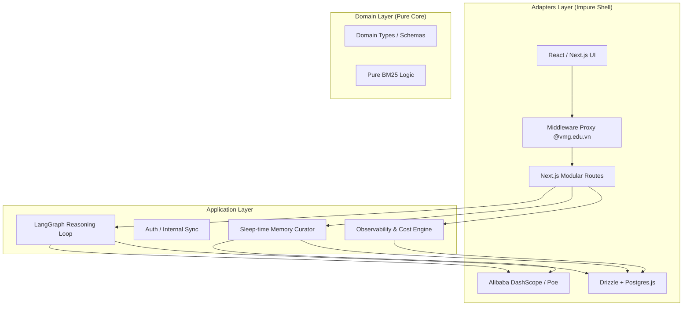
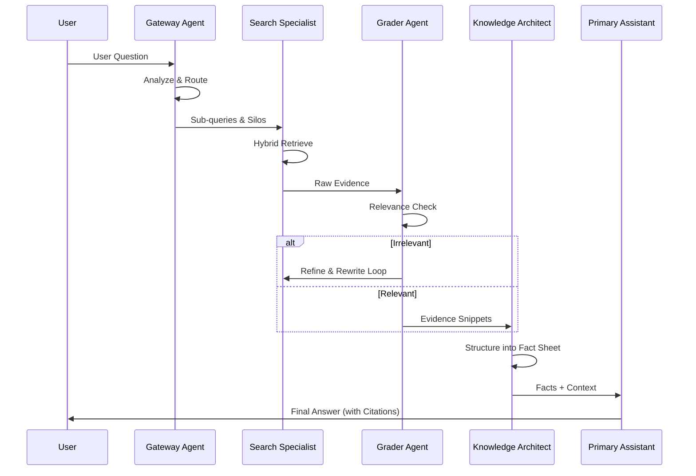
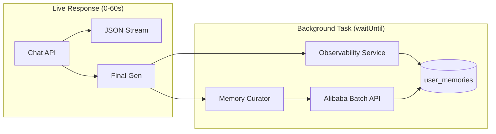

# VMG MATE: Agentic Architecture

VMG MATE is a high-integrity Agentic AI system built on Clean Architecture and the "Glass Box" observability principle.

## 1. System Layering

## 2. Hybrid Execution Model

### A. Synchronous Reasoning Loop (The "Thinking" Phase)
This occurs in real-time while the user waits.

### B. Asynchronous Background Loop (The "Observability" Phase)
Uses Vercel `waitUntil` to process data without slowing down the user.

## 3. Multi-Agent Ecosystem

| Agent | Task | Optimization |
| :--- | :--- | :--- |
| **Gateway** | Routing & Intent | Tiered Pricing (Flash) |
| **Search/Grader** | Retrieval Integrity | Tiered Pricing (Flash) |
| **Architect** | Fact Sheet Compression | Context Caching (90% Off) |
| **Curator** | Memory Reconciliation | Batch API (50% Off) |

## 4. Cost Engineering
The system implements **Tiered Pricing Logic** for `qwen3.6-flash`:
- **Tier 1 (<= 256K tokens)**: $0.25/1M Input | $1.5/1M Output.
- **Tier 2 (> 256K tokens)**: $1.00/1M Input | $4.00/1M Output.
- **Cache Hit**: 10% of input base price ($0.025 in Tier 1).
- **Batch**: 50% of input/output base price.
