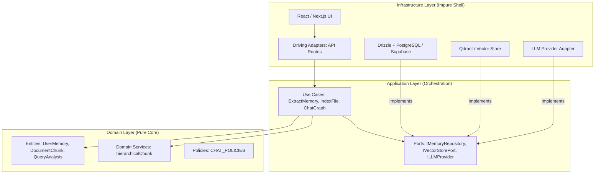
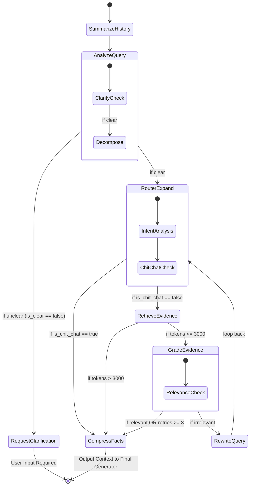

# VMG MATE: Agentic Architecture & Ecosystem

**VMG MATE (Multi-Agent Tooling Ecosystem) Version 4.1.0** is a high-integrity Agentic AI system built on strict **Clean Architecture**, "Glass Box" observability principles, and advanced Context Engineering. 

It is designed as a professional digital companion for VMG English Center employees, operating under the philosophy: **"Machines execute, humans direct."**

---

## 1. High-Level System Architecture

VMG MATE follows a strict 3-layer Clean Architecture, ensuring that domain logic is pure and infrastructure details are completely decoupled via Ports.

---

## 2. Multi-Agent RAG Graph (The "Thinking" Phase)

The core reasoning of VMG MATE is managed by a LangGraph state machine (`src/core/agent/rag-graph.ts`). It employs a Metacognitive Reasoning loop with Dependency Injection for high testability.

### Agent Roles in the Graph:
1. **Query Architect (AnalyzeQuery)**: **[New in 4.1.0]** Detects ambiguity and vague pronouns. Automatically decomposes complex queries into parallelizable sub-queries. Polices language matching.
2. **Gateway Agent (RouterExpand)**: Classifies "chit-chat" vs "factual" queries. Selects target knowledge silos based on expanded intents.
3. **Search Specialist (Retrieve)**: Executes hierarchical search. Maps Child chunks back to unique Parent IDs to prevent context fragmentation.
4. **Knowledge Evidence Grader (Grade)**: Evaluates if retrieved documents actually answer the user's intent.
5. **Knowledge Architect (Compress)**: Transforms raw data into a **SUPER CONCISE Fact Sheet**, shedding 50%+ of redundant tokens.

---

## 3. Context Management & Rot Defenses

To prevent **Context Rot** (instruction fade-out, goal drift), VMG MATE implements multi-layered defenses.

### A. The 40-60% Rule & Structured Compaction
Instead of naive truncation, MATE uses an aggressive, early compaction strategy starting at **6 conversation turns**.

### B. Hierarchical Retrieval (Parent-Child Mapping)
**[New in 4.1.0]** MATE now indexes documents in two stages:
- **Child Chunks**: Small (~500 chars), optimized for high-precision semantic search.
- **Parent Chunks**: Large (Markdown headers), providing the full "Truth Sheet" context.
- **Deduplication**: If multiple children match, only the unique Parent context is used in the graph.

---

## 4. Long-Term Memory Curator (The "Knowledge Auditor")

VMG MATE possesses an "Eternal Memory." A decoupled `ExtractUserMemoriesUseCase` monitors the chat for personal disclosures.

**Anti-Garbage Rules**:
- ONLY remembers explicit personal info (Name, role, department, preferences).
- NEVER remembers questions or AI-retrieved facts.
- **Strict Intent**: Detects if the user is answering a bot's question rather than searching.

---

## 5. Observability & Cost Engine ("Glass Box")

VMG MATE tracks every LLM invocation via the `IObservabilityPort`.

### Tiered Pricing Logic
Calculates exact USD cost based on pricing tiers, including heavy discounts for Context Caching.

---

## 6. Model Provider Configurations

| Engine / Node | Reasoning Effort | Justification |
| :--- | :--- | :--- |
| **Agentic Steps** | `instant` | Speed is critical for multi-step loops. Cost efficiency. |
| **Final Generation** | `high` | Maximum cognitive depth for synthesizing complex policies. |
| **Knowledge Architect** | `high` | Requires deep structural understanding for compression. |
| **Memory Curator** | `high` | Accuracy is paramount for long-term state. |

---
*Document Updated: April 2026 (Clean Architecture Refactor)*
