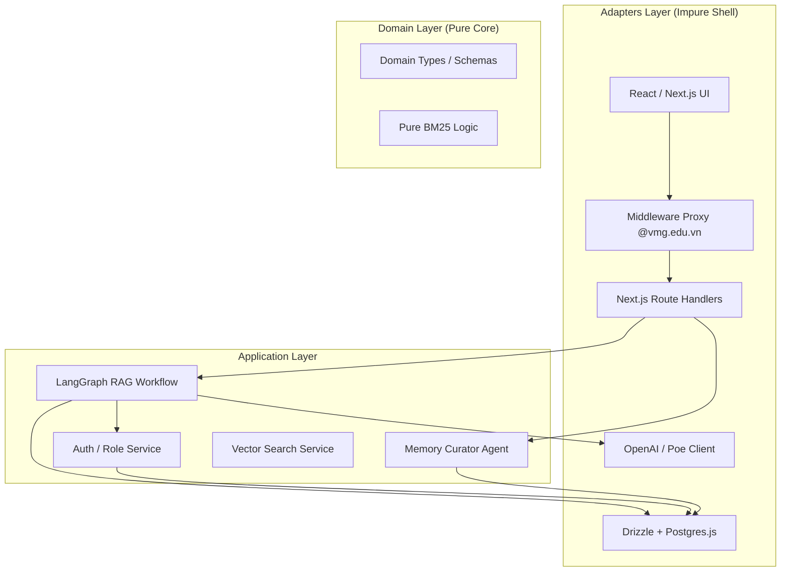
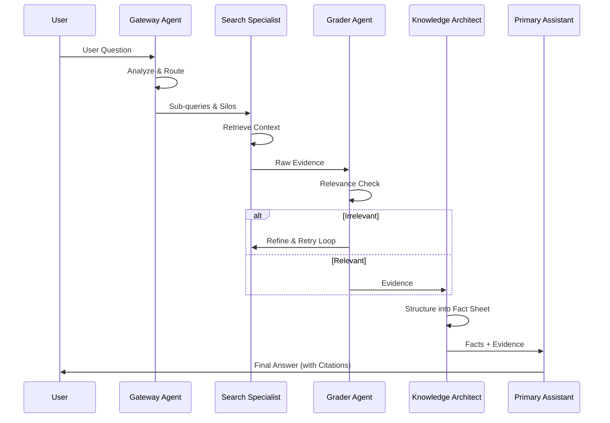
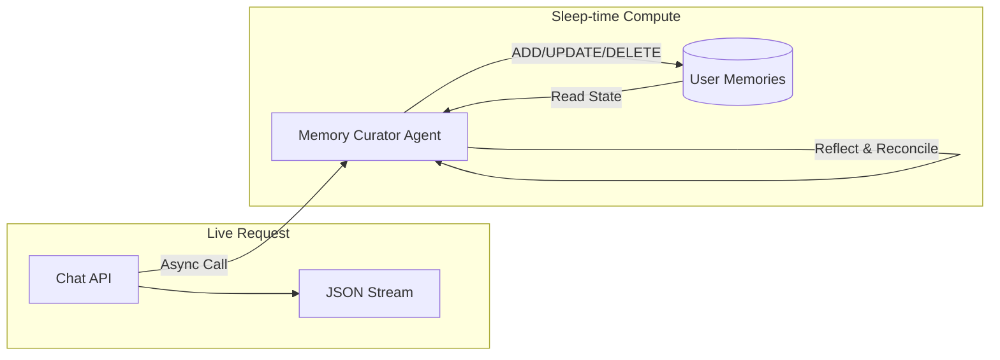

# Project Architecture: VMG MATE

This document provides a comprehensive technical overview of the VMG MATE system, mapping its components to Clean Architecture layers and detailing the sophisticated Multi-Agent orchestration.

## 1. Core Principles
- **Dependency Rule**: Dependencies point inward: `Adapters → Application → Domain`.
- **Pure Domain**: The Domain layer contains zero side effects or external dependencies.
- **Agentic Orchestration**: Uses LangGraph to manage complex, stateful reasoning loops.
- **Sleep-time Compute**: Background agents reconcile and maintain long-term state asynchronously.

## 2. System Layering

## 3. Multi-Agent Ecosystem

VMG MATE operates as a group of specialized agents sharing a common state.

| Agent | Role | Persistence |
| :--- | :--- | :--- |
| **Primary Assistant** | Final response generation and user interaction. | Short-term (Session) |
| **Gateway Agent** | Intent classification and Knowledge Silo routing. | Volatile |
| **Search Specialist** | Multi-query expansion and vector retrieval. | Volatile |
| **Grader Agent** | Evaluates document relevance to prevent hallucinations. | Volatile |
| **Knowledge Architect** | Compresses raw data into structured "Fact Sheets". | Volatile |
| **Memory Curator** | Background reconciliation of user facts (Add/Update/Delete). | Long-term (DB) |

## 4. Agent Interaction & Communication

### A. Synchronous Reasoning Loop (The "Thinking" Phase)
This loop occurs in real-time during a chat request. The agents communicate by updating a shared `AgentState` object.

### B. Asynchronous Sleep-time Loop (The "Memory" Phase)
Inspired by the **Letta/MemGPT** architecture, this agent runs after the user response is delivered to manage the agent's long-term "Persona Block".

## 5. Metadata & Grounding
- **Citations**: Sources are carried as metadata through the entire pipeline (Retrieval -> Compression -> Generation).
- **Passive Data Injection**: Long-term memories are injected into the System Prompt as READ-ONLY XML blocks to prevent prompt injection.
- **Stateful Layout**: The chat state is preserved in the layout to ensure the streaming reasoning trace isn't lost during internal navigation.
