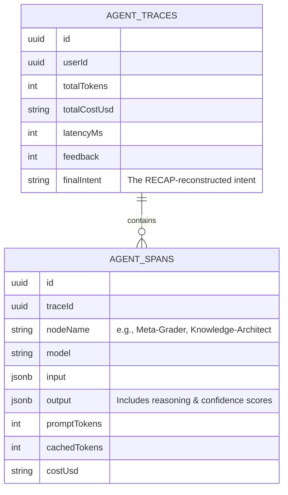
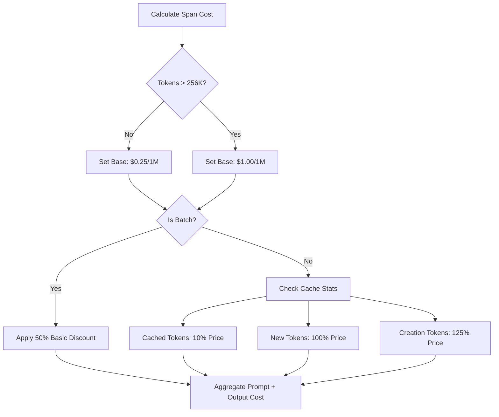

# Glass Box Observability & Monitoring

VMG MATE provides deep visibility into agent reasoning and costs using a "Traces & Spans" architecture. We adhere to **Process-Aware Observability**, ensuring every internal decision—from query routing to evidence grading—is traceable, verifiable, and secure.

---

## 1. Trace Hierarchy: Process over Outcome

Unlike traditional logs, MATE tracks the **Reasoning Path**. This allows developers and auditors to see exactly *why* an agent reached a specific conclusion.

### Logical Data Model
A Trace is the parent of multiple Spans, representing a single turn of the Agentic Graph.

---

## 2. Node-Level Monitoring (Process-Awareness)

We track specific metrics at the node level to detect failures in the agentic pipeline:

| Node Name | Success Metric | Failure Indicator |
| :--- | :--- | :--- |
| **Query Architect** | High clarity score (`is_clear: true`) | Vague clarification questions. |
| **Meta-Grader** | Accurate relevance flagging | Hallucinated answer with "NO" relevance. |
| **Knowledge Architect** | 50%+ token compression | Loss of core facts in the Fact Sheet. |
| **Memory Curator** | High precision personal facts | Extraction of generic search queries. |

---

## 3. Token Accounting & Pricing Engine

We use `js-tiktoken` (`cl100k_base`) for accurate token estimation. The pricing engine follows a specific priority, rewarding **Context Engineering** and **Compaction**.

### Tiered Pricing Logic
MATE calculates exact USD cost based on pricing tiers, including heavy discounts for Context Caching.

---

## 4. Lifecycle & Finalization

To ensure observability data is never lost, the system follows a strict **Finalization Protocol**:
- **Traces must be finalized**: Even on early-exit paths (Clarification/Error), the `obsPort.finalizeTrace` method is called.
- **Wait Until**: We use `waitUntil` (Next.js/Vercel) to finalize traces without blocking the user-facing response stream.

---

## 5. UI Feedback Loop
The UI links every Assistant message to a `traceId`.
- **Thumbs Up**: Validates the reasoning path and retrieval accuracy.
- **Thumbs Down**: Signals a need for manual audit of the reasoning spans to identify where the "Knowledge Architect" or "Grader" failed.
- **Process Audit**: Admins can view the raw JSON input/output of every node in the graph for debugging.

---
*Document Updated: April 2026 (Process-Aware Observability Refactor)*
