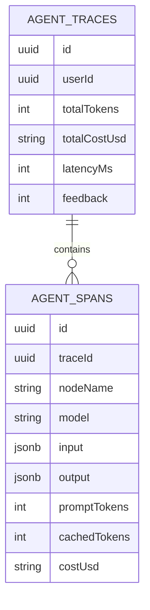
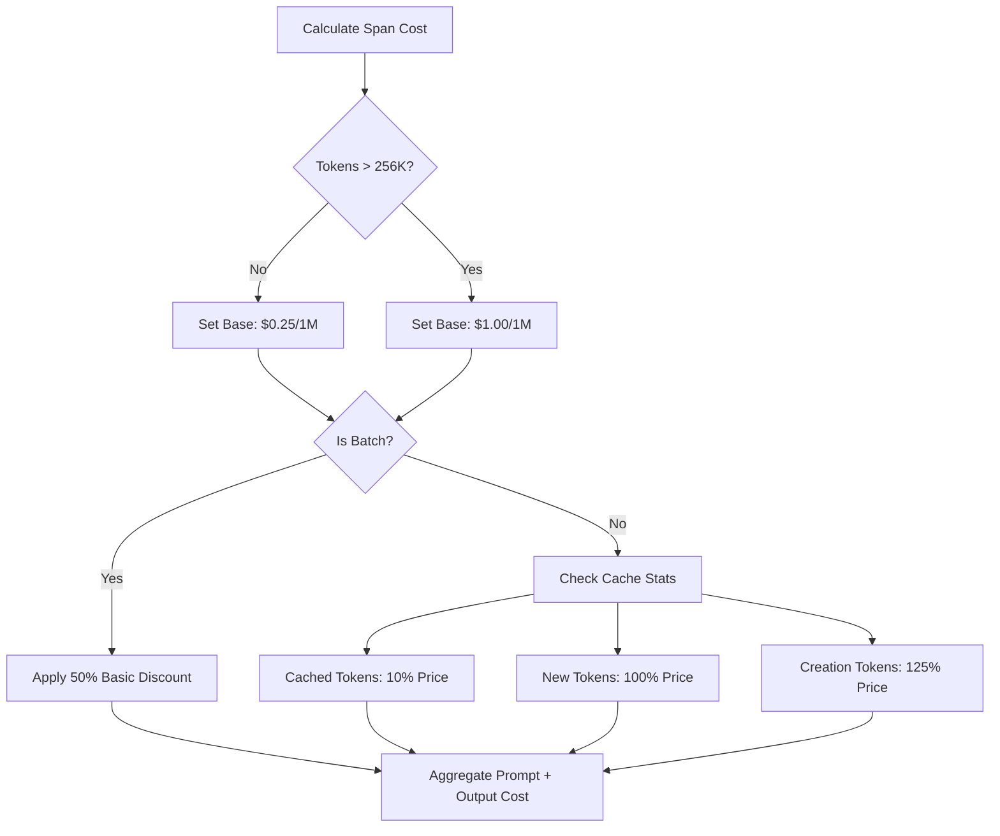

# Glass Box Observability & Monitoring

VMG MATE provides deep visibility into agent reasoning and costs using a "Traces & Spans" architecture.

## 1. Trace Hierarchy

### Logical Data Model
A Trace is the parent of multiple Spans.

## 2. Token Accounting & Pricing Engine

We use `js-tiktoken` (`cl100k_base`) for accurate token estimation. The pricing engine follows a specific priority:

## 3. UI Feedback Loop
The UI links every Assistant message to a `traceId`.
- **Thumbs Up**: Validates the reasoning path.
- **Thumbs Down**: Signals a need for manual audit of the reasoning spans to identify where the "Knowledge Architect" or "Grader" failed.
