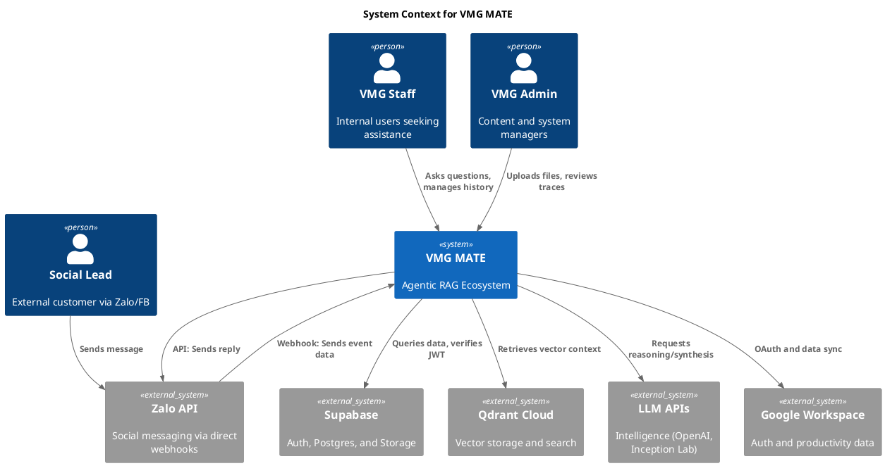

# 3. System Scope and Context

System Scope and Context clarifies the boundaries of VMG MATE and its interaction with the environment.

## 3.1 Business Context

VMG MATE serves as the central orchestration hub for internal knowledge and external communication.

| Communication Partner | Responsibility |
| :--- | :--- |
| **VMG Staff** | Interact with MATE for knowledge retrieval, task automation, and profile management. |
| **VMG Admins** | Manage knowledge silos, monitor system health (traces), and ingest data. |
| **Social Leads (Zalo/FB)** | Potential leads and customers interacting via social channels. |
| **Zalo API** | External messaging platform. MATE integrates via **Direct Webhooks** for lean, low-latency communication. |
| **Google Workspace** | Integration for Gmail, Calendar, and document reading (Future). |

## 3.2 Technical Context (C4 Context Diagram)

The following diagram illustrates the technical boundaries and external system dependencies.

## 3.3 Deployment Context & Portability

To ensure transition readiness for **Vietnamese Servers (VPS/Cloud)**:
- **Application:** Designed to be containerized via **Docker**.
- **State:** Decoupled from specific cloud providers; uses standard PostgreSQL and Qdrant protocols.
- **Entry:** Webhook endpoints are standard HTTP/Zod-validated to ensure compatibility with generic VPS hosting.
