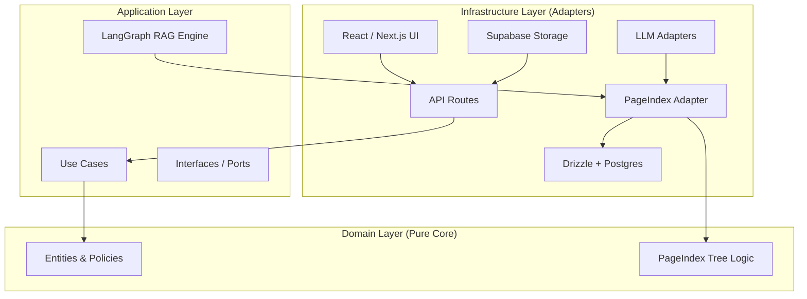

# 5. Building Block View

## 5.1 Level 1: Clean Architecture Layers



### 5.1.1 Domain Layer
Pure business logic: entities (User, Conversation, Memory), PageIndex tree builder and searcher (no I/O).

### 5.1.2 Application Layer
Use cases + the LangGraph agent engine. The graph is a simple linear pipeline:
`summarize → analyze_query → retrieve → compress`

### 5.1.3 Infrastructure Layer
Drizzle + Postgres, Supabase Storage, LLM providers, PageIndex adapter (bridges pure tree logic to DB).

## 5.2 Agent Graph (4 Nodes)

| Node | Responsibility |
| :--- | :--- |
| **summarize** | Compacts conversation history to prevent context overflow. |
| **analyze_query** | Determines chitchat vs knowledge query. Reconstructs intent. |
| **retrieve** | Runs PageIndex two-tier search: cluster selection → FS tree → recursive document tree search. Returns evidence + navigation trace. |
| **compress** | Synthesizes final answer from retrieved evidence with citations. |

## 5.3 PageIndex Retrieval Pipeline

### 5.3.1 Ingestion
1. File uploaded to Supabase Storage → downloaded as buffer → extracted to text
2. PageIndex tree builder: parses markdown headings → builds hierarchical tree → enriches nodes with LLM summaries
3. Tree stored in `knowledge_files.metadata.pageindexTree` (jsonb)
4. LLM generates file summary → stored in `knowledge_files.summary`
5. LLM assigns 1-3 topic cluster labels → stored in `knowledge_files.metadata.clusters`

### 5.3.2 Query-Time Retrieval
1. **Cluster selection**: 1 LLM call — picks relevant topic clusters from cached labels (scales to 1000+ files)
2. **Document filtering**: only files in selected clusters proceed
3. **Recursive tree search**: per document, LLM navigates layer-by-layer — at each level sees only immediate children (~5-15 nodes), selects relevant branches, descends
4. **Content extraction**: leaf nodes return full content. No embedding bottleneck, no top-K cutoff.

### 5.3.3 Key Properties
- **Vectorless**: No embeddings, no chunking, no vector DB.
- **Relevance classification**: LLM judges each node — \"does this subtree contain the answer?\"
- **Recursive by default**: Always navigates layer-by-layer like a human reading a table of contents.
- **No corrective loop**: PageIndex already classifies relevance at every node. If nothing found, answer generator handles it.
| **Summarize History** | Context Engineering: Distills chat history into "Working Memory Snapshots." |
| **Analyze Query** | Query Reconstruction: Resolves ellipsis and intent shifts. |
| **Router Expand** | Gateway: Determines if the query requires RAG, Chit-Chat, or a corrective loop. |
| **Retrieve** | URASys Retrieval: Performs hierarchical search in Qdrant. |
| **Grade** | Meta-Grader: Reflects on evidence quality and hallucination risks. |
| **Rewrite** | Corrective Loop: Re-architects the search query if evidence is poor. |
| **Compress** | Fact Synthesis: Distills retrieved documents into a compact fact sheet. |

### 5.2.3 Node Deep-Dive: Logic, Provenance & Rationale

Each node in the RAG graph follows a specific academic or architectural concept. The table below documents what each node does, which framework/paper it draws from, and why that approach was chosen over alternatives.

#### Summarize History

| Aspect | Detail |
|--------|--------|
| **Logic** | Compresses the conversation history into a concise `context_summary` using an LLM call. Only the summary and last 4 messages are kept in the active prompt — older messages are discarded. |
| **Concept / Framework** | **Context Distillation / Working Memory.** Similar to MemGPT [arxiv:2310.08560] and LLM-based memory compression. The summary acts as a "working memory snapshot" — a lossy but compact representation of prior turns. |
| **Why this approach** | Long conversations cause "Lost in the Middle" syndrome [arxiv:2307.03172] where LLMs lose track of early context. Truncation alone discards information; summarization preserves key facts while staying within context limits. A sliding window of the last 4 messages provides immediate conversational continuity. |
| **Alternatives considered** | *Full history injection* (too expensive, loses signal in noise); *Vector memory retrieval* (overkill for short sessions); *No summarization* (context overflow after 5+ turns). |

#### Analyze Query

| Aspect | Detail |
|--------|--------|
| **Logic** | Takes the last user message plus recent context from the `context_summary`, and produces a rewritten, self-contained query. Resolves pronouns ("nó" → "học bổng"), detects real vs. fake intent shifts, and classifies intent as SEARCH (needs retrieval) or DISCLOSURE (user providing information). |
| **Concept / Framework** | **Query Rewriting / Intent Resolution.** Standard technique in multi-turn RAG systems (e.g., LlamaIndex Query Rewriting, LangChain's query analysis). Also related to co-reference resolution in NLP. |
| **Why this approach** | Users naturally use pronouns and follow-up shortcuts ("Còn ở Sydney thì sao?"). Without reconstruction, the retriever would search for "Sydney thì sao" instead of "học bổng du học tại Sydney". A single LLM call is fast (~200ms) and handles Vietnamese co-reference well. |
| **Alternatives considered** | *Heuristic regex co-reference* (brittle, fails on Vietnamese); *Dedicated NER model* (overhead, no benefit over LLM for this scale); *No rewriting* (retriever fails on elliptical queries). |

#### Router Expand

| Aspect | Detail |
|--------|--------|
| **Logic** | Classifies the reconstructed query into one of two paths: (1) **RAG** — needs factual retrieval from knowledge base, (2) **Chit-Chat** — general conversation, no retrieval needed. If RAG, it also selects which knowledge collections to target based on intent. |
| **Concept / Framework** | **Intent Routing / Query Classification.** Similar to RouteLLM [arxiv:2406.06215] and classifier-guided retrieval. The router acts as a gating function that decides whether to engage the full CRAG pipeline. |
| **Why this approach** | Not every query needs retrieval. Greetings ("Chào bạn"), confirmations ("Cảm ơn"), or off-topic questions should bypass the expensive CRAG pipeline entirely. This saves cost (~60% of queries are chit-chat in typical use) and reduces latency. Collection routing also narrows search scope, improving relevance. |
| **Alternatives considered** | *Always retrieve* (wasteful, hallucination risk on chit-chat); *Single collection* (irrelevant hits from wrong silo); *User-selected collection* (bad UX). |

#### Retrieve

| Aspect | Detail |
|--------|--------|
| **Logic** | Performs hybrid search (vector + keyword) against Qdrant's hierarchical index. Uses the **URASys** (Universal Retrieval & Augmentation System) structure: retrieves child chunks (fine-grained) and maps back to parent chunks (full context). k=10 per query for broad recall. |
| **Concept / Framework** | **Hierarchical Retrieval (Parent/Child Chunking).** Similar to LlamaIndex's Hierarchical Node Parser and Anthropic's contextual retrieval. Combines semantic vector search with BM25 keyword matching. |
| **Why this approach** | (1) **Parent/Child**: Child chunks (~200 tokens) maximize semantic precision; parent chunks (~1000 tokens) provide surrounding context for the LLM. (2) **Hybrid**: Vector search catches semantic similarity; keyword search catches exact term matches (especially important for Vietnamese proper nouns like "Trường Đại học Ngoại thương"). (3) **k=10**: Broad initial recall prevents edge-relevant documents from being missed (see CRAG loop for refinement). |
| **Alternatives considered** | *Flat chunks only* (lose surrounding context); *Pure vector search* (misses keyword-relevant docs); *Pure keyword* (misses semantic matches); *Lower k* (too narrow, CRAG loop can't recover). |

#### Grade

| Aspect | Detail |
|--------|--------|
| **Logic** | A lightweight LLM call that evaluates whether the retrieved evidence actually answers the reconstructed query. Decomposes the question into atomic claims and checks each against the evidence. Outputs `is_relevant: true/false` with a reasoning note. Always runs after retrieve (unconditional edge). |
| **Concept / Framework** | **Meta-Grader / Self-RAG [arxiv:2310.11511].** Inspired by Self-RAG's reflection tokens and CRAG's [arxiv:2401.15884] corrective verification. The grade node acts as a quality gate between retrieval and synthesis. |
| **Why this approach** | Without grading, the system would synthesize answers from irrelevant documents — the primary cause of hallucination in RAG systems. Grading is cheap (single LLM call, ~100ms) and catches ~40% of retrieval failures in practice. The unconditional edge (always grade, regardless of token count) is critical — prior to the fix in April 2026, large document sets bypassed grading and produced confident-sounding but wrong answers. |
| **Alternatives considered** | *Skip grading* (hallucination risk); *Embedding similarity threshold* (brittle threshold, fails on nuance); *Only grade small docs* (the bug we fixed — large irrelevant docs went undetected). |

#### Rewrite

| Aspect | Detail |
|--------|--------|
| **Logic** | When Grade returns `is_relevant: false`, this node generates 2 alternative search queries using synonyms, rephrasing, and broader terms. The rewritten queries are fed back into the Router → Retrieve loop for a retry. |
| **Concept / Framework** | **Corrective RAG (CRAG) [arxiv:2401.15884] / Query Expansion.** The core of the corrective loop. Also related to HyDE [arxiv:2212.10496] (hypothetical document embeddings) and query expansion techniques in information retrieval. |
| **Why this approach** | The first retrieval may fail because: (1) the user's phrasing doesn't match document wording ("học bổng" vs "hỗ trợ tài chính"), (2) the query is too specific/narrow. Rewriting broadens the search surface. The CRAG loop (retrieve → grade → rewrite → retrieve) is inspired by the corrective RAG paper, which shows iterative refinement significantly improves recall on hard queries. |
| **Alternatives considered** | *Single retry with same query* (unlikely to find new docs); *Skip and return empty* (bad UX); *HyDE* (expensive, generates full hypothetical docs vs. simple query rewrites). |

#### Compress

| Aspect | Detail |
|--------|--------|
| **Logic** | Takes the retrieved (and graded-relevant) documents and distills them into a concise, LLM-generated fact sheet. Extracts only the claims relevant to the user's query, removing redundant or off-topic content. |
| **Concept / Framework** | **Evidence Distillation / LLM-based Compression.** Similar to Recomp [arxiv:2310.04408] and FILCO [arxiv:2305.14627]. The compression step reduces token usage in the final synthesis prompt while preserving critical evidence. |
| **Why this approach** | Retrieved documents often contain irrelevant sections (e.g., a 1000-token parent chunk may only have 200 tokens relevant to the query). Passing all tokens to the synthesis prompt wastes context window and dilutes signal. Compression also serves as a final relevance filter — irrelevant docs produce empty compressions, which the system can detect before generation. |
| **Alternatives considered** | *Raw evidence injection* (context waste, noisy); *Extractive only* (may miss synthesized insights); *Skip compression* (generation prompt too large, expensive). |

### 5.2.4 Overall Architecture: The CRAG Loop

These nodes form a **Corrective RAG (CRAG)** [arxiv:2401.15884] architecture with a Meta-Grader (Self-RAG-inspired) quality gate:

```
User Query → [Summarize → Analyze → Router] → Retrieve → Grade
                                                    ↑         ↓
                                              [Rewrite] ← [not relevant?]
                                                       ↓
                                              [relevant?] → Compress → Generate
```

**Why CRAG over other RAG architectures:**

| Architecture | Our choice? | Reason |
|-------------|-------------|--------|
| **Naive RAG** (retrieve → generate) | ❌ Rejected | No quality control; hallucinates on irrelevant retrievals. |
| **Advanced RAG** (pre-retrieval rewriting) | ⚠️ Partial | We use query reconstruction (analyze node) but need post-retrieval grading too. |
| **CRAG (Corrective RAG)** | ✅ **Selected** | The grade → rewrite loop provides self-correction without external feedback. Best balance of quality vs. cost for a production chatbot. |
| **Self-RAG** (LLM generates own retrieval decisions) | ⚠️ Related | Our Meta-Grader is Self-RAG-inspired but lighter — we use a separate evaluator call rather than having the generator reflect on its own output. |
| **ReAct** (interleave reasoning & action) | ❌ Rejected | Too expensive for simple Q&A; unnecessary for a single-retrieval-per-query pattern. Overkill for our use case. |
| **RECAP** (recursive decomposition) | ❌ Rejected | Designed for long-horizon tasks (20–200+ steps). Our queries resolve in 1–3 steps; recursion adds 3× cost with no benefit. See §4.4.3 for discussion. |

**Key design properties of our CRAG loop:**
- **Always grade**: No conditional bypass (fixed April 2026). Ensures the corrective loop is always active.
- **Max 3 iterations**: `CHAT_POLICIES.MAX_ITERATIONS` prevents infinite loops. After exhaustion, best-effort synthesis.
- **Broad initial recall (k=10)**: Gives the grader more to work with — a narrow first pass reduces the chance that rewriting can recover.
- **Reconstructed queries for grading**: Grade evaluates against `rewrittenQuestions`, not raw user input, ensuring it judges the right thing.

### 5.2.2 Phase 2: Synthesis & Memory (API Route)
After the reasoning graph completes, the system enters the generation and maintenance phase:

| Component | Responsibility |
| :--- | :--- |
| **Generative Synthesis** | Streams the final response to the user using the reasoning state and evidence. |
| **Memory Extractor** | **Self-Improvement (Background):** A Use Case that extracts significant facts and user preferences from the finalized conversation. |
| **Trace Finalizer** | **Observability (Background):** Ensures all spans are closed and total cost/latency is recorded. |

## 5.3 Level 2: Data Persistence

| Component | Responsibility |
| :--- | :--- |
| **Drizzle Adapters** | Manages relational data (Users, Traces, Conversations) via PostgreSQL. |
| **Qdrant Adapters** | Manages vector data and hierarchical indexing (Parent/Child chunks). |
| **S3/Storage Adapters** | Manages raw document files for knowledge ingestion. |

### 5.3.1 Relational Schema Overview

All relational data is managed via **PostgreSQL** through **Drizzle ORM** (`src/core/db/schema.ts`). The schema follows the database design principles defined in §2.4.

```
┌─────────────────────────────────────────────────────────────────┐
│                        Domain Groups                            │
├──────────┬──────────┬──────────┬──────────┬──────────┬──────────┤
│  Auth    │  Chat    │ Memory   │ Knowledge│ Observ.  │ Reports  │
│  users   │ convs    │ memories │ k_files  │ traces   │ reports  │
│          │          │ mem_tasks│ k_colls  │ spans    │          │
└──────────┴──────────┴──────────┴──────────┴──────────┴──────────┘
```

### 5.3.2 Table Reference

#### `users` — Authentication & Profile

| Column | Type | Constraints | Notes |
|--------|------|-------------|-------|
| `id` | `uuid` | PK, default `gen_random_uuid()` | Internal user ID |
| `supabase_id` | `uuid` | UNIQUE, NOT NULL | Links to Supabase Auth |
| `email` | `text` | UNIQUE, NOT NULL | Business email (@vmg.edu.vn) |
| `full_name` | `text` | nullable | From Google OAuth |
| `avatar_url` | `text` | nullable | From Google OAuth |
| `role` | `user_role` enum | NOT NULL, default `'user'` | `admin` \| `staff` \| `user` |
| `metadata` | `jsonb` | default `{}` | Flexible profile extensions |
| `created_at` | `timestamp` | default `now()` | |
| `updated_at` | `timestamp` | default `now()` | |

#### `conversations` — Chat Sessions

| Column | Type | Constraints | Notes |
|--------|------|-------------|-------|
| `id` | `uuid` | PK | Generated client-side via `uuidv4()` |
| `user_id` | `uuid` | FK → `users.id`, nullable | Soft reference; anonymous sessions possible |
| `title` | `text` | default `'Cuộc hội thoại mới'` | Auto-generated by LLM |
| `is_starred` | `integer` | default `0` | `0` or `1` |
| `messages` | `jsonb` | NOT NULL, default `[]` | Full message array (denormalized for performance) |
| `location_coords` | `jsonb` | nullable | Optional GPS data |
| `location_address` | `text` | nullable | Human-readable address |
| `token_usage` | `jsonb` | nullable | Aggregated token stats |
| `message_count` | `integer` | default `0` | Cache count for sorting |
| `metadata` | `jsonb` | default `{}` | Flexible session data |
| `created_at` | `timestamp` | default `now()` | |
| `updated_at` | `timestamp` | default `now()` | |

Indexes: `user_id_idx` on `user_id`.

#### `user_memories` — Long-Term Memory (Knowledge Agent)

| Column | Type | Constraints | Notes |
|--------|------|-------------|-------|
| `id` | `uuid` | PK, default `gen_random_uuid()` | |
| `user_id` | `uuid` | FK → `users.id`, NOT NULL | Owner of the memory |
| `fact` | `text` | NOT NULL | Third-person fact (e.g., "User prefers PDF exports") |
| `category` | `text` | NOT NULL, default `'general'` | `persona` \| `preference` \| `entity` \| `episodic` \| `general` |
| `metadata` | `jsonb` | default `{}` | Confidence scores, source refs |
| `created_at` | `timestamp` | default `now()` | |

Indexes: `user_memories_user_id_idx` on `user_id`, unique index on `(user_id, fact)` for deduplication.

#### `user_memory_tasks` — Batch Memory Processing

| Column | Type | Constraints | Notes |
|--------|------|-------------|-------|
| `id` | `uuid` | PK, default `gen_random_uuid()` | |
| `user_id` | `uuid` | FK → `users.id`, NOT NULL | |
| `batch_id` | `text` | UNIQUE, NOT NULL | Batch identifier |
| `status` | `text` | NOT NULL, default `'in_progress'` | `validating` \| `in_progress` \| `completed` \| `failed` |
| `output_file_id` | `text` | nullable | Reference to result |
| `created_at` | `timestamp` | default `now()` | |

#### `knowledge_files` — Ingested Documents

| Column | Type | Constraints | Notes |
|--------|------|-------------|-------|
| `id` | `uuid` | PK, default `gen_random_uuid()` | |
| `filename` | `text` | UNIQUE, NOT NULL | Original filename |
| `source_url` | `text` | nullable | Storage URL |
| `status` | `file_status` enum | NOT NULL, default `'pending'` | `pending` \| `indexing` \| `completed` \| `failed` |
| `error_message` | `text` | nullable | Error details if failed |
| `mode` | `text` | NOT NULL | Collection name / mode |
| `folder` | `text` | default `'root'` | Virtual folder path |
| `progress` | `integer` | default `0` | 0–100 |
| `summary` | `text` | nullable | LLM-generated summary |
| `logs` | `jsonb` | default `[]` | Processing log entries |
| `created_at` | `timestamp` | default `now()` | |
| `updated_at` | `timestamp` | default `now()` | |

#### `knowledge_collections` — Knowledge Silos

| Column | Type | Constraints | Notes |
|--------|------|-------------|-------|
| `id` | `uuid` | PK, default `gen_random_uuid()` | |
| `name` | `text` | UNIQUE, NOT NULL | Human-readable name |
| `qdrant_name` | `text` | UNIQUE, NOT NULL | Corresponding Qdrant collection |
| `description` | `text` | nullable | Purpose of this silo |
| `allowed_roles` | `jsonb` | default `['admin','staff','user']` | RBAC for this silo |
| `created_at` | `timestamp` | default `now()` | |

#### `reports` — User Feedback/Flags

| Column | Type | Constraints | Notes |
|--------|------|-------------|-------|
| `id` | `uuid` | PK, default `gen_random_uuid()` | |
| `user_id` | `uuid` | FK → `users.id`, nullable | Soft reference |
| `reported_message` | `text` | NOT NULL | The flagged message |
| `conversation` | `jsonb` | NOT NULL | Full conversation context at time of report |
| `note` | `text` | nullable | User's explanation |
| `session_id` | `text` | nullable | Session identifier |
| `created_at` | `timestamp` | default `now()` | |

#### `agent_traces` — Observability Root

| Column | Type | Constraints | Notes |
|--------|------|-------------|-------|
| `id` | `uuid` | PK, default `gen_random_uuid()` | |
| `user_id` | `uuid` | FK → `users.id`, nullable | Null after anonymization |
| `conversation_id` | `uuid` | FK → `conversations.id`, nullable | |
| `total_tokens` | `integer` | NOT NULL, default `0` | Aggregated from spans |
| `total_cost_usd` | `text` | NOT NULL, default `'0'` | Formatted cost string |
| `latency_ms` | `integer` | NOT NULL, default `0` | Total latency |
| `feedback` | `integer` | default `0` | `1` (good) / `-1` (bad) / `0` (none) |
| `error` | `text` | nullable | Error message if failed |
| `is_anonymized` | `integer` | default `0` | `1` after right-to-forgotten request |
| `created_at` | `timestamp` | default `now()` | |

#### `agent_spans` — Observability Node Details

| Column | Type | Constraints | Notes |
|--------|------|-------------|-------|
| `id` | `uuid` | PK, default `gen_random_uuid()` | |
| `trace_id` | `uuid` | FK → `agent_traces.id`, NOT NULL | Parent trace |
| `node_name` | `text` | NOT NULL | e.g., `'grade'`, `'retrieve'` |
| `model` | `text` | NOT NULL | LLM model used |
| `input` | `jsonb` | nullable | Raw input to the node |
| `output` | `jsonb` | nullable | Raw output from the node |
| `prompt_tokens` | `integer` | NOT NULL, default `0` | |
| `completion_tokens` | `integer` | NOT NULL, default `0` | |
| `cached_tokens` | `integer` | NOT NULL, default `0` | |
| `cache_creation_tokens` | `integer` | NOT NULL, default `0` | |
| `cost_usd` | `text` | NOT NULL, default `'0'` | Per-span cost |
| `latency_ms` | `integer` | NOT NULL, default `0` | Per-span latency |
| `created_at` | `timestamp` | default `now()` | |

### 5.3.3 Entity Relationships

```
users 1──N conversations    (user_id FK, soft reference)
users 1──N user_memories     (user_id FK, required)
users 1──N user_memory_tasks (user_id FK, required)
users 1──N agent_traces      (user_id FK, soft reference — null after anonymization)
users 1──N reports           (user_id FK, soft reference)

agent_traces 1──N agent_spans     (trace_id FK, required)
agent_traces N──1 conversations   (conversation_id FK, soft reference)
```

### 5.3.4 Design Rationale

| Decision | Rationale |
|----------|-----------|
| **`messages` as `jsonb`** | Conversations are always read/written as a unit. Normalizing messages into a separate table would add JOIN overhead with no benefit. The entire message array is replaced on save. |
| **Optional FKs on `user_id`** | Enables data anonymization (right to be forgotten) — setting `user_id` to null preserves audit integrity while unlinking identity. |
| **`total_cost_usd` as `text`** | Formatted cost strings avoid floating-point rounding issues in Postgres. Precision is handled at the application layer. |
| **`is_anonymized` flag** | Separate flag from nulling `user_id` allows the system to distinguish between "never had a user" and "user was anonymized". |
| **Unique index on `(user_id, fact)`** | Prevents duplicate memory entries from the Knowledge Agent's extraction loop. |
| **`allowed_roles` as `jsonb`** | Array of role strings is simple and avoids a separate join table for RBAC. |
