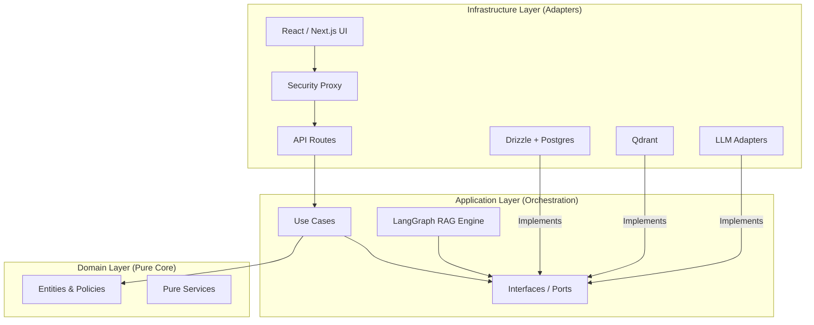

# 5. Building Block View

The Building Block View provides a static decomposition of the VMG MATE system into its constituent parts.

## 5.1 Level 1: Clean Architecture Layers

VMG MATE follows a strict 3-layer Clean Architecture to ensure infrastructure portability (Law 91/2025 readiness).

### 5.1.1 Domain Layer
Contains the core business logic, entities (User, Conversation, Memory), and pure transformation services. It has zero dependencies on frameworks or libraries.

### 5.1.2 Application Layer
Orchestrates the flow of data. It contains the **LangGraph RAG Engine** and defines **Ports** (interfaces) that the infrastructure layer must implement.
- **Structured State (AgentState):** The central communication bus. It uses a machine-readable schema (via LangGraph Annotations) to store sub-queries, evidence pools, and reflection notes. This ensures that every agent node has the context it needs to perform its specific subtask.

### 5.1.3 Infrastructure Layer
Implements the technical details. This includes the database adapters, vector search implementations, and the UI framework.

## 5.2 Level 2: Agentic RAG Engine (The "Brain")

The system operates in two distinct execution phases:

### 5.2.1 Phase 1: Agentic Reasoning (LangGraph)
The `Graph` in the Application layer is decomposed into specialized reasoning nodes:

| Node | Responsibility |
| :--- | :--- |
| **Summarize History** | Context Engineering: Distills chat history into "Working Memory Snapshots." |
| **Analyze Query** | Intent Reconstruction (RECAP): Resolves ellipsis and intent shifts. |
| **Router Expand** | Gateway: Determines if the query requires RAG, Chit-Chat, or a corrective loop. |
| **Retrieve** | URASys Retrieval: Performs hierarchical search in Qdrant. |
| **Grade** | Meta-Grader: Reflects on evidence quality and hallucination risks. |
| **Rewrite** | Corrective Loop: Re-architects the search query if evidence is poor. |
| **Compress** | Fact Synthesis: Distills retrieved documents into a compact fact sheet. |

### 5.2.2 Phase 2: Synthesis & Memory (API Route)
After the reasoning graph completes, the system enters the generation and maintenance phase:

| Component | Responsibility |
| :--- | :--- |
| **Generative Synthesis** | Streams the final response to the user using the reasoning state and evidence. |
| **Memory Extractor** | **Self-Improvement (Background):** A Use Case that extracts significant facts and user preferences from the finalized conversation. |
| **Trace Finalizer** | **Observability (Background):** Ensures all spans are closed and total cost/latency is recorded. |

## 5.3 Level 2: Data Persistence

| Component | Responsibility |
| :--- | :--- |
| **Drizzle Adapters** | Manages relational data (Users, Traces, Conversations) via PostgreSQL. |
| **Qdrant Adapters** | Manages vector data and hierarchical indexing (Parent/Child chunks). |
| **S3/Storage Adapters** | Manages raw document files for knowledge ingestion. |
