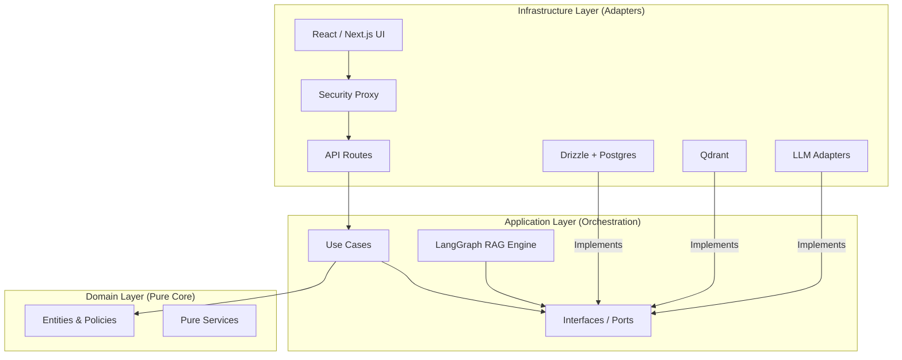

# 5. Building Block View

The Building Block View provides a static decomposition of the VMG MATE system into its constituent parts.

## 5.1 Level 1: Clean Architecture Layers

VMG MATE follows a strict 3-layer Clean Architecture to ensure infrastructure portability (Law 91/2025 readiness).



### 5.1.1 Domain Layer
Contains the core business logic, entities (User, Conversation, Memory), and pure transformation services. It has zero dependencies on frameworks or libraries.

### 5.1.2 Application Layer
Orchestrates the flow of data. It contains the **LangGraph RAG Engine** and defines **Ports** (interfaces) that the infrastructure layer must implement.
- **Structured State (AgentState):** The central communication bus. It uses a machine-readable schema (via LangGraph Annotations) to store sub-queries, evidence pools, and reflection notes. This ensures that every agent node has the context it needs to perform its specific subtask.

### 5.1.3 Infrastructure Layer
Implements the technical details. This includes the database adapters, vector search implementations, and the UI framework.

## 5.2 Level 2: Agentic RAG Engine (The "Brain")

The system operates in two distinct execution phases:

### 5.2.1 Phase 1: Agentic Reasoning (LangGraph)
The `Graph` in the Application layer is decomposed into specialized reasoning nodes:

| Node | Responsibility |
| :--- | :--- |
| **Summarize History** | Context Engineering: Distills chat history into "Working Memory Snapshots." |
| **Analyze Query** | Intent Reconstruction (RECAP): Resolves ellipsis and intent shifts. |
| **Router Expand** | Gateway: Determines if the query requires RAG, Chit-Chat, or a corrective loop. |
| **Retrieve** | URASys Retrieval: Performs hierarchical search in Qdrant. |
| **Grade** | Meta-Grader: Reflects on evidence quality and hallucination risks. |
| **Rewrite** | Corrective Loop: Re-architects the search query if evidence is poor. |
| **Compress** | Fact Synthesis: Distills retrieved documents into a compact fact sheet. |

### 5.2.2 Phase 2: Synthesis & Memory (API Route)
After the reasoning graph completes, the system enters the generation and maintenance phase:

| Component | Responsibility |
| :--- | :--- |
| **Generative Synthesis** | Streams the final response to the user using the reasoning state and evidence. |
| **Memory Extractor** | **Self-Improvement (Background):** A Use Case that extracts significant facts and user preferences from the finalized conversation. |
| **Trace Finalizer** | **Observability (Background):** Ensures all spans are closed and total cost/latency is recorded. |

## 5.3 Level 2: Data Persistence

| Component | Responsibility |
| :--- | :--- |
| **Drizzle Adapters** | Manages relational data (Users, Traces, Conversations) via PostgreSQL. |
| **Qdrant Adapters** | Manages vector data and hierarchical indexing (Parent/Child chunks). |
| **S3/Storage Adapters** | Manages raw document files for knowledge ingestion. |

### 5.3.1 Relational Schema Overview

All relational data is managed via **PostgreSQL** through **Drizzle ORM** (`src/core/db/schema.ts`). The schema follows the database design principles defined in §2.4.

```
┌─────────────────────────────────────────────────────────────────┐
│                        Domain Groups                            │
├──────────┬──────────┬──────────┬──────────┬──────────┬──────────┤
│  Auth    │  Chat    │ Memory   │ Knowledge│ Observ.  │ Reports  │
│  users   │ convs    │ memories │ k_files  │ traces   │ reports  │
│          │          │ mem_tasks│ k_colls  │ spans    │          │
└──────────┴──────────┴──────────┴──────────┴──────────┴──────────┘
```

### 5.3.2 Table Reference

#### `users` — Authentication & Profile

| Column | Type | Constraints | Notes |
|--------|------|-------------|-------|
| `id` | `uuid` | PK, default `gen_random_uuid()` | Internal user ID |
| `supabase_id` | `uuid` | UNIQUE, NOT NULL | Links to Supabase Auth |
| `email` | `text` | UNIQUE, NOT NULL | Business email (@vmg.edu.vn) |
| `full_name` | `text` | nullable | From Google OAuth |
| `avatar_url` | `text` | nullable | From Google OAuth |
| `role` | `user_role` enum | NOT NULL, default `'user'` | `admin` \| `staff` \| `user` |
| `metadata` | `jsonb` | default `{}` | Flexible profile extensions |
| `created_at` | `timestamp` | default `now()` | |
| `updated_at` | `timestamp` | default `now()` | |

#### `conversations` — Chat Sessions

| Column | Type | Constraints | Notes |
|--------|------|-------------|-------|
| `id` | `uuid` | PK | Generated client-side via `uuidv4()` |
| `user_id` | `uuid` | FK → `users.id`, nullable | Soft reference; anonymous sessions possible |
| `title` | `text` | default `'Cuộc hội thoại mới'` | Auto-generated by LLM |
| `is_starred` | `integer` | default `0` | `0` or `1` |
| `messages` | `jsonb` | NOT NULL, default `[]` | Full message array (denormalized for performance) |
| `location_coords` | `jsonb` | nullable | Optional GPS data |
| `location_address` | `text` | nullable | Human-readable address |
| `token_usage` | `jsonb` | nullable | Aggregated token stats |
| `message_count` | `integer` | default `0` | Cache count for sorting |
| `metadata` | `jsonb` | default `{}` | Flexible session data |
| `created_at` | `timestamp` | default `now()` | |
| `updated_at` | `timestamp` | default `now()` | |

Indexes: `user_id_idx` on `user_id`.

#### `user_memories` — Long-Term Memory (Knowledge Agent)

| Column | Type | Constraints | Notes |
|--------|------|-------------|-------|
| `id` | `uuid` | PK, default `gen_random_uuid()` | |
| `user_id` | `uuid` | FK → `users.id`, NOT NULL | Owner of the memory |
| `fact` | `text` | NOT NULL | Third-person fact (e.g., "User prefers PDF exports") |
| `category` | `text` | NOT NULL, default `'general'` | `persona` \| `preference` \| `entity` \| `episodic` \| `general` |
| `metadata` | `jsonb` | default `{}` | Confidence scores, source refs |
| `created_at` | `timestamp` | default `now()` | |

Indexes: `user_memories_user_id_idx` on `user_id`, unique index on `(user_id, fact)` for deduplication.

#### `user_memory_tasks` — Batch Memory Processing

| Column | Type | Constraints | Notes |
|--------|------|-------------|-------|
| `id` | `uuid` | PK, default `gen_random_uuid()` | |
| `user_id` | `uuid` | FK → `users.id`, NOT NULL | |
| `batch_id` | `text` | UNIQUE, NOT NULL | Batch identifier |
| `status` | `text` | NOT NULL, default `'in_progress'` | `validating` \| `in_progress` \| `completed` \| `failed` |
| `output_file_id` | `text` | nullable | Reference to result |
| `created_at` | `timestamp` | default `now()` | |

#### `knowledge_files` — Ingested Documents

| Column | Type | Constraints | Notes |
|--------|------|-------------|-------|
| `id` | `uuid` | PK, default `gen_random_uuid()` | |
| `filename` | `text` | UNIQUE, NOT NULL | Original filename |
| `source_url` | `text` | nullable | Storage URL |
| `status` | `file_status` enum | NOT NULL, default `'pending'` | `pending` \| `indexing` \| `completed` \| `failed` |
| `error_message` | `text` | nullable | Error details if failed |
| `mode` | `text` | NOT NULL | Collection name / mode |
| `folder` | `text` | default `'root'` | Virtual folder path |
| `progress` | `integer` | default `0` | 0–100 |
| `summary` | `text` | nullable | LLM-generated summary |
| `logs` | `jsonb` | default `[]` | Processing log entries |
| `created_at` | `timestamp` | default `now()` | |
| `updated_at` | `timestamp` | default `now()` | |

#### `knowledge_collections` — Knowledge Silos

| Column | Type | Constraints | Notes |
|--------|------|-------------|-------|
| `id` | `uuid` | PK, default `gen_random_uuid()` | |
| `name` | `text` | UNIQUE, NOT NULL | Human-readable name |
| `qdrant_name` | `text` | UNIQUE, NOT NULL | Corresponding Qdrant collection |
| `description` | `text` | nullable | Purpose of this silo |
| `allowed_roles` | `jsonb` | default `['admin','staff','user']` | RBAC for this silo |
| `created_at` | `timestamp` | default `now()` | |

#### `reports` — User Feedback/Flags

| Column | Type | Constraints | Notes |
|--------|------|-------------|-------|
| `id` | `uuid` | PK, default `gen_random_uuid()` | |
| `user_id` | `uuid` | FK → `users.id`, nullable | Soft reference |
| `reported_message` | `text` | NOT NULL | The flagged message |
| `conversation` | `jsonb` | NOT NULL | Full conversation context at time of report |
| `note` | `text` | nullable | User's explanation |
| `session_id` | `text` | nullable | Session identifier |
| `created_at` | `timestamp` | default `now()` | |

#### `agent_traces` — Observability Root

| Column | Type | Constraints | Notes |
|--------|------|-------------|-------|
| `id` | `uuid` | PK, default `gen_random_uuid()` | |
| `user_id` | `uuid` | FK → `users.id`, nullable | Null after anonymization |
| `conversation_id` | `uuid` | FK → `conversations.id`, nullable | |
| `total_tokens` | `integer` | NOT NULL, default `0` | Aggregated from spans |
| `total_cost_usd` | `text` | NOT NULL, default `'0'` | Formatted cost string |
| `latency_ms` | `integer` | NOT NULL, default `0` | Total latency |
| `feedback` | `integer` | default `0` | `1` (good) / `-1` (bad) / `0` (none) |
| `error` | `text` | nullable | Error message if failed |
| `is_anonymized` | `integer` | default `0` | `1` after right-to-forgotten request |
| `created_at` | `timestamp` | default `now()` | |

#### `agent_spans` — Observability Node Details

| Column | Type | Constraints | Notes |
|--------|------|-------------|-------|
| `id` | `uuid` | PK, default `gen_random_uuid()` | |
| `trace_id` | `uuid` | FK → `agent_traces.id`, NOT NULL | Parent trace |
| `node_name` | `text` | NOT NULL | e.g., `'grade'`, `'retrieve'` |
| `model` | `text` | NOT NULL | LLM model used |
| `input` | `jsonb` | nullable | Raw input to the node |
| `output` | `jsonb` | nullable | Raw output from the node |
| `prompt_tokens` | `integer` | NOT NULL, default `0` | |
| `completion_tokens` | `integer` | NOT NULL, default `0` | |
| `cached_tokens` | `integer` | NOT NULL, default `0` | |
| `cache_creation_tokens` | `integer` | NOT NULL, default `0` | |
| `cost_usd` | `text` | NOT NULL, default `'0'` | Per-span cost |
| `latency_ms` | `integer` | NOT NULL, default `0` | Per-span latency |
| `created_at` | `timestamp` | default `now()` | |

### 5.3.3 Entity Relationships

```
users 1──N conversations    (user_id FK, soft reference)
users 1──N user_memories     (user_id FK, required)
users 1──N user_memory_tasks (user_id FK, required)
users 1──N agent_traces      (user_id FK, soft reference — null after anonymization)
users 1──N reports           (user_id FK, soft reference)

agent_traces 1──N agent_spans     (trace_id FK, required)
agent_traces N──1 conversations   (conversation_id FK, soft reference)
```

### 5.3.4 Design Rationale

| Decision | Rationale |
|----------|-----------|
| **`messages` as `jsonb`** | Conversations are always read/written as a unit. Normalizing messages into a separate table would add JOIN overhead with no benefit. The entire message array is replaced on save. |
| **Optional FKs on `user_id`** | Enables data anonymization (right to be forgotten) — setting `user_id` to null preserves audit integrity while unlinking identity. |
| **`total_cost_usd` as `text`** | Formatted cost strings avoid floating-point rounding issues in Postgres. Precision is handled at the application layer. |
| **`is_anonymized` flag** | Separate flag from nulling `user_id` allows the system to distinguish between "never had a user" and "user was anonymized". |
| **Unique index on `(user_id, fact)`** | Prevents duplicate memory entries from the Knowledge Agent's extraction loop. |
| **`allowed_roles` as `jsonb`** | Array of role strings is simple and avoids a separate join table for RBAC. |
