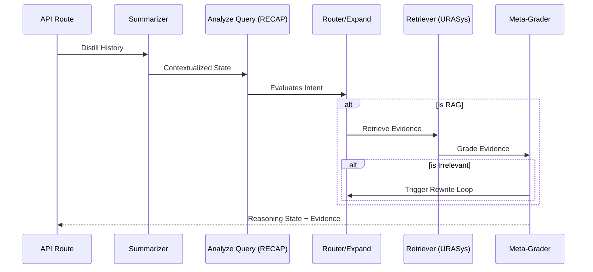
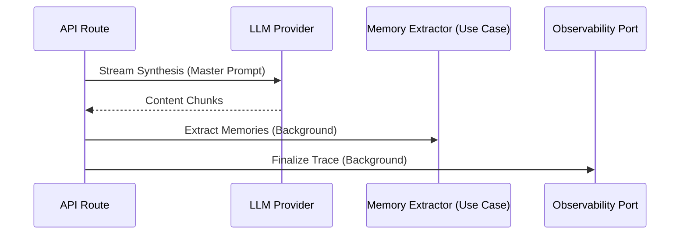

# 6. Runtime View

The Runtime View describes how the building blocks interact to fulfill specific use cases.

## 6.1 Scenario: Two-Phase RAG Execution

VMG MATE executes queries in two distinct, sequential phases.

### 6.1.1 Phase 1: Agentic Reasoning (LangGraph)
The system determines "how" to answer by planning and retrieving evidence.

### 6.1.2 Phase 2: Synthesis & Maintenance (API Route)
The system generates the final answer and performs background maintenance.

## 6.2 Scenario: Meta-Grading & Hallucination Defense

The `grade` node acts as a quality gate.
1.  **Stimulus:** Retriever returns 3 documents.
2.  **Logic:** The node evaluates if the documents actually contain the information needed to answer the query.
3.  **Branching:**
    - If `Relevant`: Proceeds to compression/synthesis.
    - If `Irrelevant`: Redirects to the `rewrite` node to broaden the search query and re-attempts retrieval (max iterations enforced by `CHAT_POLICIES`).

## 6.4 Context Management Simulation (Step-by-Step Trace)

This simulation demonstrates how the `AgentState` evolves through a multi-turn conversation to maintain high-fidelity context.

### Turn 1: Initial Query
**User:** "What is the VMG health insurance policy?"

| Node | Action | `AgentState` Key Updates |
| :--- | :--- | :--- |
| **Start** | Input received. | `messages`: [UserMessage("What is the...")] |
| **Summarize** | History is empty. | `context_summary`: "" (No summary needed yet). |
| **Analyze** | Intent is clear. | `rewrittenQuestions`: ["VMG health insurance policy detail"] |
| **Router** | Maps to "HR/Policies". | `targetCollections`: ["hr_policy"] |
| **Retrieve** | Fetches 2 chunks. | `evidence`: { docs: [Chunk1, Chunk2] } |
| **Grade** | Evidence is relevant. | `isRelevant`: true |
| **Compress** | Synthesis. | `messages`: [..., AssistantMessage("According to policy...")] |

### Turn 2: Elliptical Follow-up
**User:** "And for my wife?"

This is a classic "Context Failure" point where RECAP (Intent Reconstruction) is critical.

| Node | Action | `AgentState` Key Updates |
| :--- | :--- | :--- |
| **Summarize** | Compresses Turn 1. | `context_summary`: "User asked about VMG health insurance. Assistant provided policy details." |
| **Analyze** | **RECAP Logic.** | `rewrittenQuestions`: ["Does VMG health insurance policy cover spouses?"] |
| **Router** | Maps to "HR/Policies". | `targetCollections`: ["hr_policy"] |
| **Retrieve** | Fetches new chunks. | `evidence`: { docs: [Chunk3 (Spouse coverage)] } |
| **Grade** | High fidelity match. | `isRelevant`: true, `reflection`: "Found spouse coverage details." |
| **Compress** | Final Answer. | `messages`: [..., AssistantMessage("Yes, VMG policy covers...")] |

### Turn 3: Context Distraction & Correction
**User:** "How do I claim for the dentist?"

| Node | Action | `AgentState` Key Updates |
| :--- | :--- | :--- |
| **Retrieve** | Fetches generic info. | `evidence`: { docs: [Chunk4 (Generic claims)] } |
| **Grade** | **Hallucination Check.** | `isRelevant`: false (Chunk 4 doesn't mention 'dentist'). |
| **Rewrite** | **Query Correction.** | `rewrittenQuestions`: ["VMG health insurance dental claim procedure"] |
| **Retrieve (2)** | Re-attempts search. | `evidence`: { docs: [Chunk5 (Dental Annex)] } |
| **Compress** | Accurate Synthesis. | `messages`: [..., AssistantMessage("To claim dental...")] |

---
*This simulation proves the efficacy of the **Glass Box** observability and the **Adaptive-Corrective RAG** pattern in handling complex, multi-turn human dialogue.*
